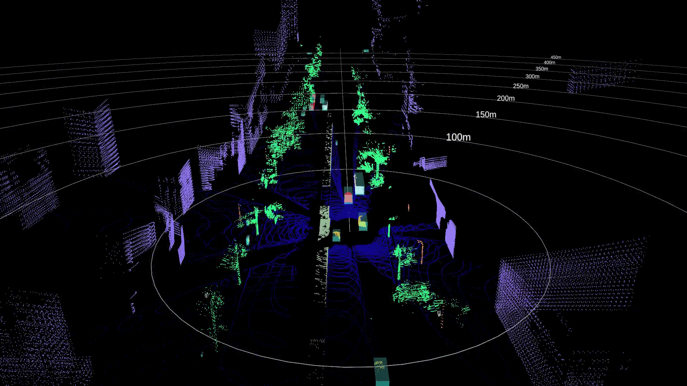

========================================
Dataset
========================================

Livox Simu-dataset v1.0    `CN <https://livox-wiki-cn.readthedocs.io/zh_CN/latest/data_summary/dataset.html>`_
------------------------------------------------------------------------------------------------------------------------------------------------------------------------

**Introduction:**

Livox Simu-dataset contains point cloud data and corresponding annotations generated based on the autonomous driving simulator, and supports 3D object detection and point cloud semantic segmentation tasks. The sensor contains 5 Horizon lidars and 1 Tele-15 lidar. The entire dataset contains 14,445 frames of 360° Lidar point cloud data, 3D bounding box annotations for 6 types of objects, and semantic annotations for 14 categories. The simulated scene contains a variety of vehicle and pedestrian models and corresponding traffic flow. In addition, a variety of traffic lights, traffic signs, partitions (isolated railings, green belts, isolated piers, etc.), trees and buildings make the entire scene closer to the actual driving scene.

**Simulated scene:**

.. image:: ../image/simulation_dataset_1.png

**Annotation demo:**

**Data format and download link:**

`Readme <https://terra-1-g.djicdn.com/65c028cd298f4669a7f0e40e50ba1131/Download/Avia/readme_CN.md>`_

`Dataset <https://terra-1-g.djicdn.com/65c028cd298f4669a7f0e40e50ba1131/Download/dataset/simu_data.zip>`_

`Data rosbag <https://terra-1-g.djicdn.com/65c028cd298f4669a7f0e40e50ba1131/Download/dataset/simu_data_rosbag.zip>`_

**Object detection demo:**

`Livox_detection_simu <https://github.com/Livox-SDK/livox_detection_simu>`_
