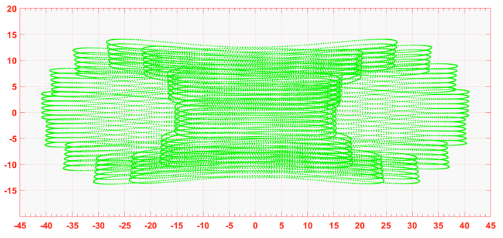
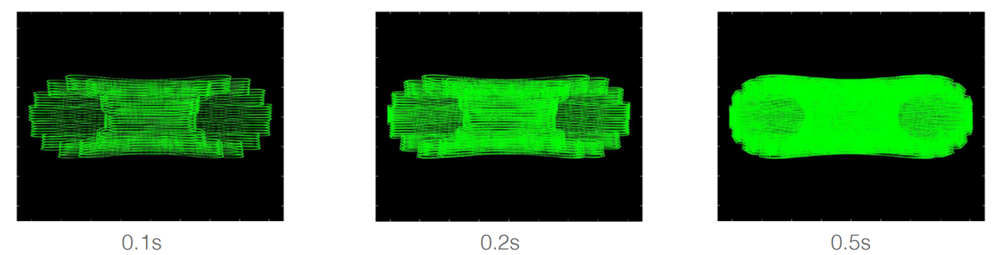
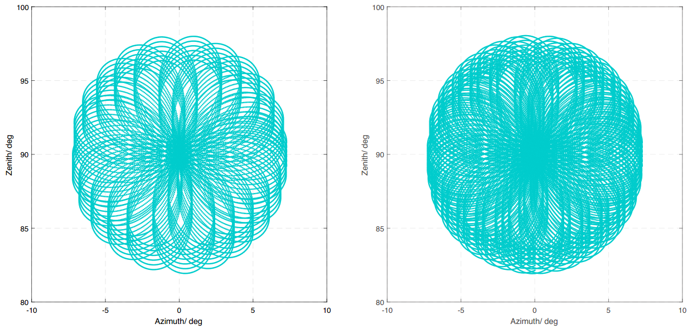
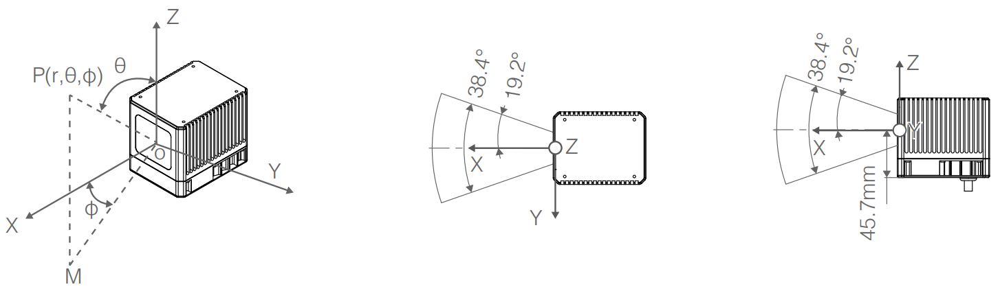

================================================================================
Livox Point Cloud and Coordinate System
================================================================================

Point Cloud Properties
~~~~~~~~~~~~~~~~~~~~~~

**Mid Series**

Livox_LiDAR can accurately perceive the complex surrounding environment and provide detailed point cloud data information. It is suitable for advanced driver assistance systems, unmanned vehicles, robots, helicopters, UAV obstacle avoidance and safety inspections. Let's take Mid series and Horizon series as examples to introduce the characteristics and parameters of Livox_LiDAR point cloud:

Livox Mid-40 and Livox Mid-100 have a higher field of view coverage by using non-repetitive scanning technology, and as the integration time increases, the field of view coverage will also increase significantly, capturing more details. The figure below shows the point cloud diagrams of Livox Mid-40 and Mid-100 at different integration times (0.1s, 0.2s, 0.5s and 1s respectively. The point cloud diagrams of each Livox Mid-100 point cloud image can be regarded as three Mid-40.

The point cloud effect diagram of Livox Mid-40 in different integration time is as follows:

.. image:: ../image/Mid-40_point_cloud_photo.png

The point cloud effect diagram of Livox Mid-100 in different integration time is as follows:

The following figure shows the coverage of the field of view of the Livox Mid-40 under different integration times, and the relevant data of several traditional multi-line mechanical lidar on the market. It can be seen from the figure that when the integration time is less than 0.1s, the field of view coverage performance of Livox Mid-40 is equivalent to that of a 32-line product; when the integration time increases, the field of view coverage of Livox Mid-40 significantly improved while the field of view coverage of a 32-line product remained unchanged. When the integration time is 0.5s, the Mid-40 field of view coverage is equivalent to a 64-line product; when the integration time continues to increase to 1.4s, the Mid-40 field of view coverage will be close to 100%, that is, almost all areas in the field of view will be hit by the laser beam.

Mid Series Point Cloud Specifications: 

.. +--------------------+-------------------------------------------------------------------------------------------------------------+
.. | 参数名称           | 参数数值                                                            |
.. +====================+========================================================================================================================+
.. | Laser Wavelength           | 905nm                                                               |
.. +--------------------+---------------------------------------------------------------------+
.. | Laser Safety           | Class 1(IEC 60825-1:2014)人眼安全                                   |
.. +--------------------+---------------------------------------------------------------------+
.. | Detection Range(@100klx)      | 90m@10%reflectivity；130m@20%reflectivity；260m@80%reflectivity                       |
.. +--------------------+---------------------------------------------------------------------+
.. | FOV                | Livox Mid-40：38.4°(圆形);Livox Mid-100：98.4°(水平)× 38.4°(竖直)   |
.. +--------------------+---------------------------------------------------------------------+
.. | 距离精度(1σ@20m)   | 2cm                                                                 |
.. +--------------------+---------------------------------------------------------------------+
.. | 角度精度           | <0.1°                                                               |
.. +--------------------+---------------------------------------------------------------------+
.. | 光束发散角度       | 0.28°(竖直)×0.03°(水平)                                             |
.. +--------------------+---------------------------------------------------------------------+
.. | 数据率             | Livox Mid-40：100,000点/秒;Livox Mid-100：300,000点/秒              |
.. +--------------------+---------------------------------------------------------------------+
.. | 虚警率(@100klx)    | <0.01%                                                              |
.. +--------------------+---------------------------------------------------------------------+

**HORIZON**

The Horizon utilizes Livox’s unique non-repetitive scanning technology and multi-laser and multi-APD DL-Pack technology. This ensures a high-density point cloud which is approximately three times denser than the Livox Mid series within the same period. Over time, the coverage inside the FOV increases significantly and reveals more detailed information of the surroundings.

Figure below displays the point cloud allocation of the Horizon inside the FOV within 0.1s. In the center of the FOV, the scanning density is denser with the average spacing of lines being 0.2° (most line spacing is from 0.1° to 0.3°), which is much denser than traditional 64-line LiDAR sensors, in which the spacing of lines is 0.3° to 0.6°. The two circular areas on both sides have a lower scanning density, with an average line spacing of 0.4° (most line spacing is between 0.2° to 0.8°), rivaling traditional 64-lines LiDAR sensors within 0.1s

Figure below displays the typical point cloud patterns of the Horizon.

Figure below displays the FOV coverage of the Horizon compared with other non-Livox LiDAR sensors that use common mechanical scanning methods. The diagram shows that when the integration time is less than 0.1 seconds, the FOV coverage of the Horizon approaches 60%, similar to the 64-line LiDAR sensor. As the integration time increases to 0.5 seconds, the FOV coverage approaches 100%, so almost all areas are illuminated by laser beams.

Horizon Point Cloud Specifications:

.. +-------------------+---------------------------------------------------------------------+
.. | 参数名称          | 参数数值                                                            |
.. +===================+=====================================================================+
.. | 激光波长          | 905nm                                                               |
.. +-------------------+---------------------------------------------------------------------+
.. | 安全级别          | Class 1(IEC 60825-1:2014)人眼安全                                   |
.. +-------------------+---------------------------------------------------------------------+
.. | 量程(@100klx)     | 90m@10%反射率；130m@20%反射率；260m@80%反射率                       |
.. +-------------------+---------------------------------------------------------------------+
.. | FOV               | 81.7°（水平)×25.1°（竖直)                                           |
.. +-------------------+---------------------------------------------------------------------+
.. | 距离随机误差      | （1σ@20m）<2cm                                                      |
.. +-------------------+---------------------------------------------------------------------+
.. | 角度随机误差      | 1σ<0.05°                                                            |
.. +-------------------+---------------------------------------------------------------------+
.. | 光束发散角度      | 0.28°(竖直)×0.03°(水平)                                             |
.. +-------------------+---------------------------------------------------------------------+
.. | 数据率            | 可配置第一回波或最强回波时：240,000 点/秒；双回波时：480,000点/秒   |
.. +-------------------+---------------------------------------------------------------------+
.. | 虚警率(@100klx)   | <0.01%                                                              |
.. +-------------------+---------------------------------------------------------------------+

**TELE-15**

The Tele-15 utilizes Livox’s unique non-repetitive scanning technology and multi-laser and multi-APD DL-Pack technology. This ensures a high-density point cloud which is approximately five times denser than the Livox Mid-40 within the same period.

Figure below displays the point cloud data of the Tele-15 inside the FOV within 0.1s. In the center of the FOV, the scanning density is as dense as traditional 300-line LiDAR sensors. In other areas of the FOV, the scanning density is significantly denser than 100-line LiDAR sensors. Within Tele-15’s FOV, the overall scanning density rivals traditional 128-lines LiDAR sensors within 0.1s.

According to the definition of Livox coordinate system, the azimuth range is 0°~360°, where -10°~0° is equivalent to 350°~360°.

Figure below displays the FOV coverage of the Tele-15 compared with other non-Livox LiDAR sensors that use common mechanical scanning methods. The diagram shows that when the integration time is 0.1 seconds, the FOV coverage of the Tele-15 is approximately 99%, higher than the 128-line LiDAR sensor.

TELE-15 Specifications: 

.. +-------------------+------------------------------------------------------------------------------------------+
.. | 参数名称          | 参数数值                                                                                 |
.. +===================+==========================================================================================+
.. | 激光波长          | 905nm                                                                                    |
.. +-------------------+------------------------------------------------------------------------------------------+
.. | 安全级别          | Class 1(IEC 60825-1:2014)人眼安全                                                        |
.. +-------------------+------------------------------------------------------------------------------------------+
.. | 量程(@100klx)     | 320m@10%反射率；500m@50%反射率                                                           |
.. +-------------------+------------------------------------------------------------------------------------------+
.. | FOV               | 14.5°（水平）×16.2°（竖直）                                                              |
.. +-------------------+------------------------------------------------------------------------------------------+
.. | 测距精度（1σ）    | <2cm（5-70m） ,<4cm（70-120m） @10%反射率；<2cm（5~220m） ,<4cm（220-380m） @80%反射率   |
.. +-------------------+------------------------------------------------------------------------------------------+
.. | 角度精度（1σ）    | <0.03°                                                                                   |
.. +-------------------+------------------------------------------------------------------------------------------+
.. | 光束发散角度      | 0.02°（水平）×0.12°（竖直）                                                              |
.. +-------------------+------------------------------------------------------------------------------------------+
.. | 点云输出          | 可配置第一回波或最强回波时：240,000 点/秒；双回波时：480,000点/秒                        |
.. +-------------------+------------------------------------------------------------------------------------------+
.. | 虚警率(@100klx)   | <0.01%                                                                                   |
.. +-------------------+------------------------------------------------------------------------------------------+

Coordinate System
~~~~~~~~~~~~~~~~~~~~~~

In multi-sensor intelligent body navigation, multiple sensors are usually installed for data fusion and calculation. It is necessary to understand that the Cartesian coordinates of Livox lidars are defined as follows:

-  Livox Mid-40 coordinate definition:

-  The IMU is built-in in Livox Horizon, the point cloud coordinate system O-XYZ and the IMU coordinate system O-X’Y’Z’ are defined as shown in the figure below:

-  The IMU is built-in in Livox Tele-15, the point cloud coordinate system O-XYZ and the IMU coordinate system O-X’Y’Z’ are defined as shown in the figure below:

Among them, the coordinates of the IMU coordinate origin O’ on the point cloud coordinate system O-XYZ are (-84.7, -42.5, -35.3) (unit: mm)

Point Cloud Data
~~~~~~~~~~~~~~~~~~~~~~

The point cloud data is the sum of all the point clouds detected on the surface of the measured object in the field of view of lidar. Each point cloud contains the following information.

-  Target reflectivity:

Expressed from 0 to 255. Among them, 0 to 150 correspond to diffuse scattering objects with reflectivity between 0 and 100%; and 151 to 255 correspond to total reflection objects.

-  Coordinate information:

The coordinate information of Livox Horizon can be expressed as rectangular coordinates (x, y, z) or spherical coordinates (r, θ, φ). The corresponding relationship between rectangular coordinates and spherical coordinates is shown in the figure below. If there is no detected object ahead or the detected object exceeds the range (for example, 600m), the point cloud output is (0, 0, 0) in the Cartesian coordinate system; the point cloud output is (0, θ, Φ) in the spherical coordinate system. The relationship between spherical coordinates and rectangular coordinates in point cloud data is as follows:

-  Tag: Indicates the return type of the laser and if the point detected is a noise. The format of the tag is as shown below

Each tag is composed of one byte. In this byte, bit7 and bit6 are Group 1, bit5 and bit4 are Group 2,
bit3 and bit2 are Group 3 while bit1 and bit0 are Group 4.
Group 2 indicates the return sequence of the sampling point. Featuring a coaxial optical path, the
Horizon itself will generate a laser return even if there is no detectable object around. This return is
recorded as return 0. After that, if there is any object within the detectable range, the first laser that
returns to the Horizon is recorded as return 1, and then return 2, and so on. If the object is too close to
the Horizon such as 1.5 m away, the first effective return will be merged into return 0, and be recorded
as return 0.
Group 3 indicates if the sampling point is a noise based on the intensity of the return. Normally, the
intensity of the returns of the noises generated due to the interference of atmosphere particles such as
dust, rain, fog, and snow is quite low. Therefore, the noises are divided into two categories based on
the intensity of the return received: "01" stands for low intensity of the return, indicating that the samples
have a high possibility of being noises such as dust; "10" stands for moderate intensity of the return,
indicating that the samples have a moderate possibility of being noises such as rain and fog. The lower
the confidence level of the sample is, the lower the possibility that it being a noise is.
Group 4 indicates if the sampling point is a noise based on its spatial position. Normally, when the
Horizon LiDAR sensors detect two close objects, there will be some thread-like noises between the two
objects. The noises are divided into three categories. The lower the confidence level of the noise is, the
lower the possibility that it being a noise is.