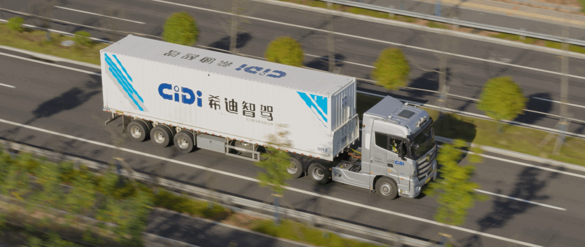
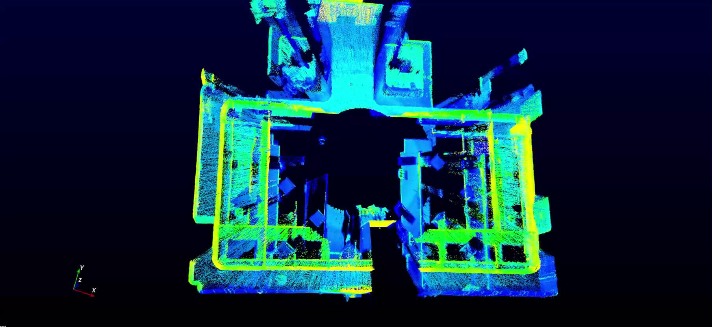

========================================
Showcase
========================================

Customer Success Story
---------------------------------------

**AutoX: Democratizing Autonomy with Latest Livox LiDAR Technology**

"We've been testing and using a great number of lidar sensors available on the market and we are excited to find one that offers a good combination of performance, realibity and cost," said Jianxiong Xiao also known as Professor X, the CEO and Founder of AutoX. “We are excited to see Livox is redefining the lidar market with their innovative technology and I am glad to announce that AutoX will be using Horizon and Tele-15 in our new robotaxi fleets in 2020."
`Learn More <https://www.livoxtech.com/showcase/4>`_

**2.Livox X CiDi: Reshape Heavy Truck Logistics Industry**

"At present, CiDi ’s L4 smart heavy trucks are already capable of autonomous driving at 100 kilometers per hour on highways. We are very confident in Livox products and are satisfied with the technical support and services they provide. With Livox LiDAR, we are very much looking forward to the rapid implementation of commercial heavy truck autonomous driving solutions, "said Matan, CEO of CiDi.
`Learn More <https://www.livoxtech.com/showcase/5>`_

**3.Livox X Gaussian: Improving The Quality of Life**

Through cooperation with Livox, we have more confidence in launching more cost-effective service robots.” Song Le, Director of Algorithm, Gaussian Robotics. 
`Learn More <https://www.livoxtech.com/showcase/6>`_

Livox Technical Applications
----------------------------------

**1.LOAM-Livox Makes Easier Lidar by Shortening the Algorithm Development Cycle**

The demonstration of actual effect of Livox Horizon proves the feasibility of applying its non-repetitive scanning of point cloud data to existing high-performance algorithms. The cost reduction far surpasses the inevitable cost of algorithm swapping.
`Learn More <https://www.livoxtech.com/showcase/7>`_

**2.Stationary Environment 3D Scanning - Efficient and Portable Mid-40 solution on a Tripod**

In this case, we use one Mid-40 and the motor mounted on top of a tripod to rotate around the z axis to scan different parts of the room, and integrate the point cloud data to give an overall 3D image. 
`Learn More <https://www.livoxtech.com/showcase/3>`_

**3.Mobile 3D Mapping - LiDAR Odometry and Mapping Algorithms Package from HKU**

To demonstrate the enormous potential of Livox LiDAR products in mobile 3D mapping, the Mechatronic and Robotic Systems (MaRS) laboratory (in the University of Hong Kong (HKU) has developed a LiDAR odometry and mapping (LOAM) algorithm specifically for Livox LiDARs – LOAM-Livox. The LOAM algorithms are open source and are available for free for the benefit developers and customers 
`Learn More <https://www.livoxtech.com/showcase/2>`_

**4.UAV 3D Mapping**

To demonstrate the great potential of Livox LiDARs in 3D mapping, this showcase how they can be integrated into a drone to accomplish mapping tasks. As a test, the 3km-long Huizhou Bay Bridge, located in Huizhou, Guangdong, China was mapped.
`Learn More <https://www.livoxtech.com/showcase/1>`_

