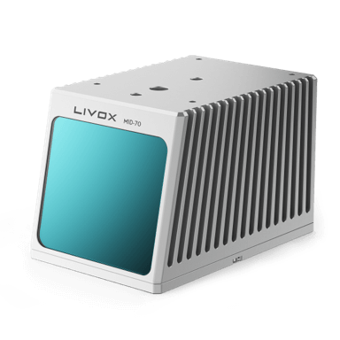
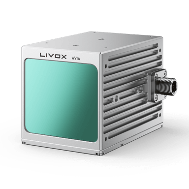

Livox Technology Company Limited is an independent company founded in 2016 through DJI’s Open Innovation Program. Livox is committed to breaking through the current technological barrier in the LiDAR industry and helping customers incorporate LiDAR sensors into efficient commercialization of their projects. Our products have been sold to 26 countries and are being widely applied in industries such as autonomous driving, robots, 3D mapping, smart city, safety and more.

Product
==============

New product introduction
-------------------------

HAP
~~~~~~~~~~~~~~~~~~~~~~
Developed by Livox for over two years, Livox HAP is our first automotive-grade lidar designed for intelligent driving assistance systems. HAP meets up to 74 items of the automotive-grade reliability tests, and began serial production for OEMs such as Xpeng and FAW Jiefang since 2021 at Livox’s own brand-new automotive-grade manufacturing center, helping customers build industry-leading smart driving systems that deliver superior safety and comfort.
`HAP <https://www.livoxtech.com/hap>`_

.. image:: ../image/HAP.png

Mid-360
~~~~~~~~~~~~~~~~~~~~~~
Mid-360 is the latest generation of Livox LiDAR for low speed robotics. This new product inherits the cost-effectiveness of the Livox Mid series and delivers 3D perception in 360 degrees. Compact and lightweight, this LiDAR module is easy to install. The Mid-360 is optimized based on the navigation and obstacle avoidance requirements of mobile robots. This allows you to use the LiDAR with algorithms to deliver a wide range of functions such as SLAM and obstacle avoidance.
`Mid-360 <https://www.livoxtech.com/mid-360>`_

.. image:: ../image/mid360.jpg

Other product introduction 
-----------------------------
New MId-70
~~~~~~~~~~~~~~~~~~~~~~
The Mid-70 is another component adding to the overall market appeal for Livox with tailored use applications such as low-speed autonomous driving and mobile robotics. By significantly expanding the vertical viewing angle, reducing blind spots and increasing close-range precision, the Mid-70 offers a thorough and comprehensive point cloud data quality to ensure safer autonomy.
`Mid-70 <https://www.livoxtech.com/mid-70>`_

New Avia
~~~~~~~~~~~~~~~~~~~~~~
The Livox Avia combines compact and lightweight design with improved detection range and efficiency, featuring an FOV greater than 70°. Its triple-echo and dual-scanning modes are ideal for use cases such as mapping and low-speed autonomous driving.
`Avia <https://www.livoxtech.com/avia>`_

Mid Series
~~~~~~~~~~~~~~~~~~~~~~
The Livox Mid-40 LiDAR sensor is incredibly cost effective. It detects objects as far as 260 meters away and uses an advanced non-repetitive scanning pattern to deliver highly accurate details in the FOV. A compact body enables users to easily embed units into existing designs for greater flexibility and performance. The Mid-40 has been mass-produced and is ready to ship immediately to facilitate uses in autonomous driving, robotics, mapping, security, and other areas from small batch testing to large-scale applications.For more infomation：
`Mid Series <https://www.livoxtech.com/mid-40-and-mid-100>`_

Horizon
~~~~~~~~~~~~~~~~~~~~~~
The Livox Horizon is a high-performance LiDAR sensor built for Level 3 and Level 4 autonomous driving. It has a long-distance detection range of up to 260 meters, high-density point clouds, and is so small that can be embedded easily into vehicles. It is also incredibly accessible, with a price point that is just 1% of traditional LiDAR sensors. The Horizon is poised to reinvent the LiDAR industry, bringing the mass production of autonomous vehicles into reality with innovative technologies and enormous cost advantages.For more infomation：
`Horizon <https://www.livoxtech.com/horizon>`_

.. image:: ../image/horizon.jpg

Tele-15
~~~~~~~~~~~~~~~~~~~~~~
Made for advanced long-distance detection, the Livox Tele-15 offers a compact size, high-precision, and durability. It allows vehicles to detect and avoid obstacles well in advance when moving at high speeds.For more infomation：
`Tele-15 <https://www.livoxtech.com/tele-15>`_

.. image:: ../image/tele-15.jpg

