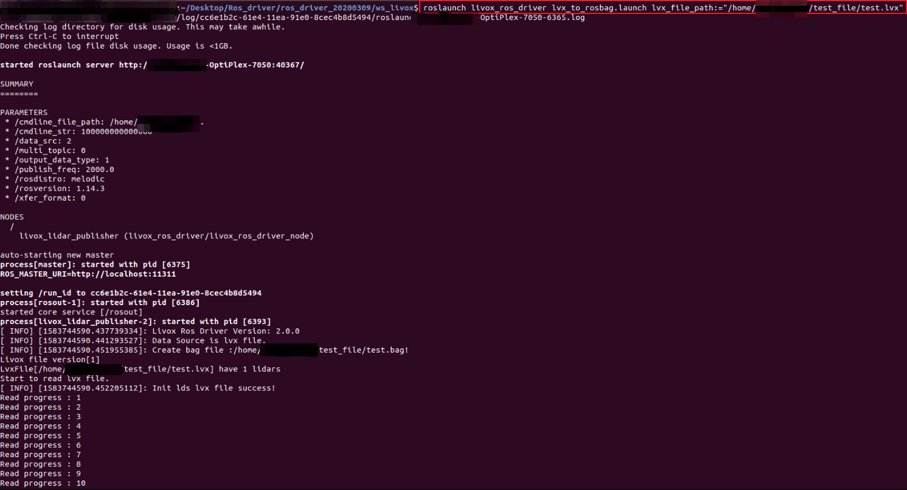
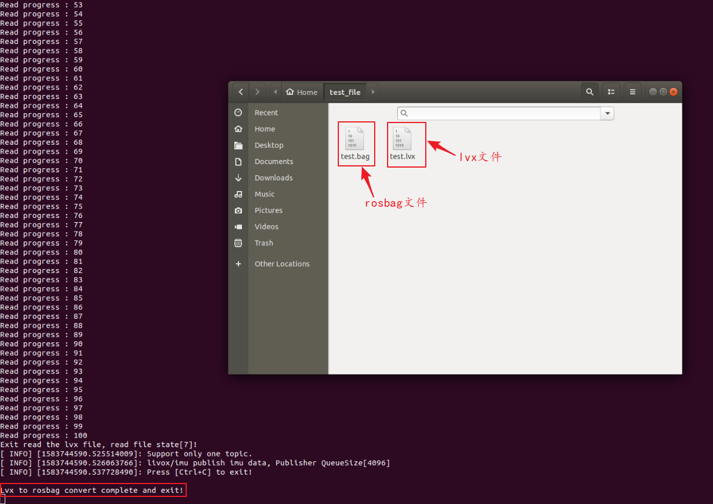
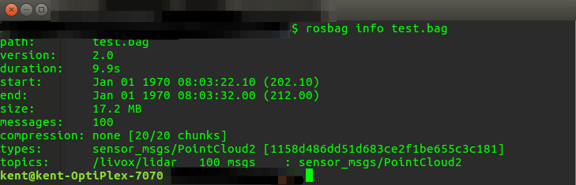
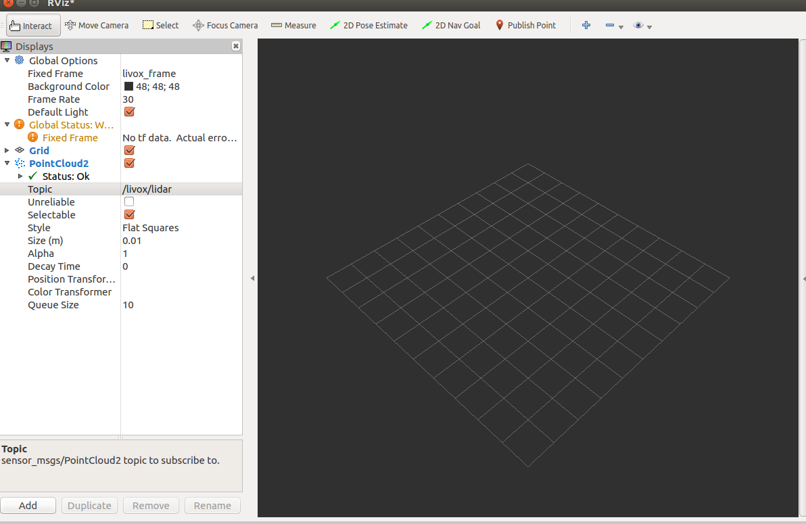
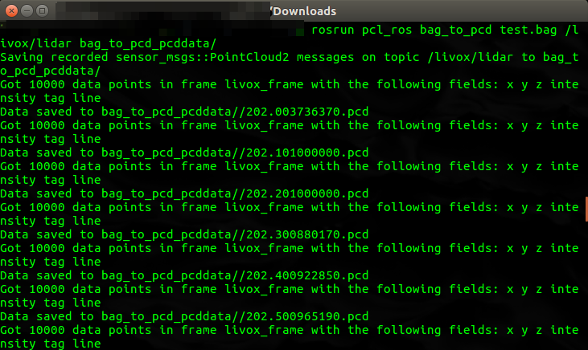
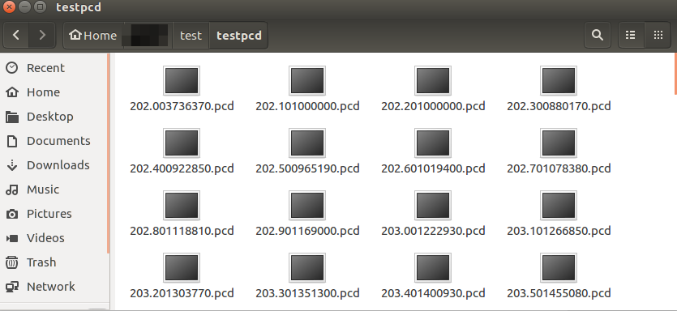

=======================================
Data format and conversion
=======================================

Introduction to Livox LiDAR data format
-------------------------------------------------------

Livox LiDAR supports multiple ways to connect and store point cloud data, and its common formats are as follows:

-  Bag file: The bag file is a commonly used point cloud data storage format in the ROS system. Livox LiDAR uses the PointCloud2 format and the custom CustomMsg format. This file records each frame of point cloud data and other sensor data during the LiDAR scanning process. Use ROS to connect to Livox LiDAR to scan and store data in this format.

-  lvx file: lvx file is the point cloud data stored after using Livox Viewer to connect to Livox LiDAR, which can be viewed and edited in Livox Viewer.

-  csv file: comma-separated value file. After using Livox Viewer to connect to Livox LiDAR, lvx point cloud data can be saved in csv format.

-  las file: It can be used to save Lidar point data records. After using Livox Viewer to connect to Livox LiDAR, point cloud data can be saved in las format.

-  pcd file: can record point cloud data of a certain frame. The data recorded by Livox LiDAR cannot be saved directly in pcd format and needs to be converted.

Data Format Conversion
-----------------------------

Convert lvx file to rosbag file and play
~~~~~~~~~~~~~~~~~~~~~~~~~~~~~~~~~~~~~~~~~~~~~~~~~~~~~~

-  dependencies:Ubuntu 16.04、ROS、livox_ros_driver (see the driver for the detailed process of downloading and installing  :doc:`Driver <../data_summary/Livox_data_summary>`)

livox_ros_driver supports converting lvx pointcloud data files into rosbag files.

Open the terminal under \ ``../ws_livox``\ and compile：

::
   
   $ catkin_make

Use the following command to update the current ROS package environment:

::
   
   $ source ./devel/setup.bash

Then use the following command:

::
   
   $ roslaunch livox_ros_driver lvx_to_rosbag.launch lvx_file_path:=""

Fill in the local lvx data file path in the double quotes in the above command to run successfully. After successful conversion, a rosbag format file with the same name will be generated under the above path, as shown in the following figure:

After obtaining the successfully converted test.bag file, you can use the rviz visualization tool to play, the steps are as follows:

Start ROS:

::
   
   $ roscore

运行rviz：

::
   
   $ rosrun rviz rviz

After successfully opening rviz, you need to add PointCloud2 and select the corresponding topic. You can use the \ ``rosbag info <filename.bag>``\ command to view the topic corresponding to the bag file, as shown below:

Add the corresponding topic in rviz:

Then play rosbag to play:

::

   $ rosbag play <test.bag>

Convert lvx file to .las or .csv file
~~~~~~~~~~~~~~~~~~~~~~~~~~~~~~~~~~~~~~~~~~~~~~~~~~~~~~~~~~~~

-  dependencies：Livox Viewer（win or ubuntu）

Livox Viewer provides a conversion tool that converts the lvx file into a las or csv file, which is convenient for users to process data. Select Tools->File Converter in the menu bar to open this tool.

Convert rosbag file to pcd file
~~~~~~~~~~~~~~~~~~~~~~~~~~~~~~~~~~~~~~~~~~~~~~~~~~

**Rosbag file with PointCloud2 format**

Reference:\ http://wiki.ros.org/pcl_ros

dependencies：Ubuntu 16.04、ROS、PCL

Run ros:

::

   $ roscore

Open the terminal under the storage path of the .bag file and run the command:

::

   $ rosrun pcl_ros bag_to_pcd <input_file.bag> <topic> <output_directory>

Where\ ``<input_file.bag>``\ is the name of the bag file to be converted.\ ``<topic>``\ is the topic information of the bag file, and \ ``<output_directory>``\ is the storage address of the pcd file after the conversion is completed.

In the corresponding folder, you can find the pcd file of each frame converted from the rosbag file, whose file name is the timestamp of the current frame:

After the conversion is completed, you can use pcl_viewer to view the pcd file.

::

   $ pcl_viewer <filename.pcd>

