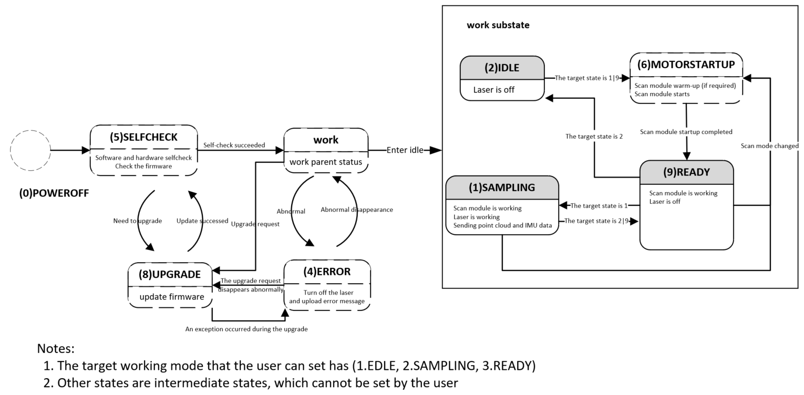
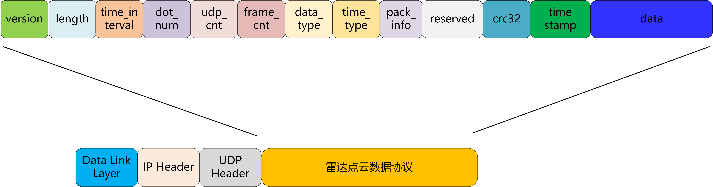
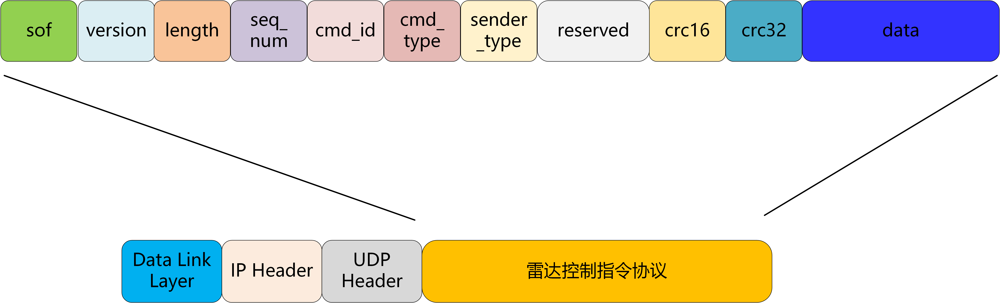
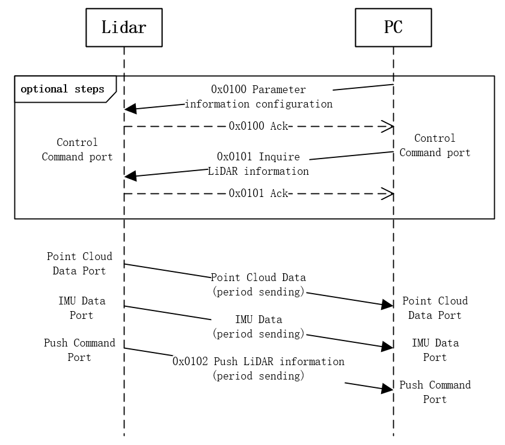

# Livox LiDAR Communication Protocol--Avia2

| **Release History** |             |                        |
| ------------------- | ----------- | ---------------------- |
| **Date**            | **Version** | **Description**        |
| 20260730            | v1.0        | 1. Initialized version |

# Overview

This communication protocol is only used for livox Avia2 LiDAR.

## Protocol Types

There are two types of data protocols between the user and the LiDAR, see as below:

**Point cloud data protocol:**

- Point cloud data sampled and output by the LiDAR;

- Internal IMU data of the LiDAR.

  For details, see (Data Types).

**Control command protocol:**

- Configure and query LiDAR parameters; LiDAR reset;

- Push and query LiDAR status;

- Upgrade related;

  For details, see (CMD Details).

Both protocols are encapsulated using UDP data segments, and the protocol data is **Little-endian**.

## LiDAR Working Status

The state machine of the current LiDAR is shown in the figure. The state enumeration values currently used by the LiDAR product are as follows:

| LiDAR Status | Enumeration Value | Whether to Support User Settings    |
| ------------ | ----------------- | ----------------------------------- |
| SAMPLING     | 0x01              | Support(By Parameter Configuration) |
| IDLE         | 0x02              | Support(By Parameter Configuration) |
| ERROR        | 0x04              | Not Support                         |
| SELFCHECK    | 0x05              | Not Support                         |
| MOTORSTARUP  | 0x06              | Not Support                         |
| READY        | 0x09              | Support(By Parameter Configuration) |

## Port Description

The source port and destination port are explained as follows according to the different data types:

| Data Type         | Transmission Direction | LiDAR Port | Host Computer Port | Transmission Type | Transmission Protocol |
| ----------------- | ---------------------- | ---------- | ------------------ | ----------------- | --------------------- |
| Device Type Query | LiDAR <----> PC        | 56000      | Any                | Broadcast         | UDP                   |

**56000 is used as the fixed listening port of Livox LiDAR, mainly used for the host computer to query the device through broadcast:**

**1. Only the device type query command (cmd_id: 0x0000) is supported. The host computer obtains the specific device type of the LiDAR through this port. This command response is replied by broadcast, so that when the host computer and the LiDAR IP are not in the same network segment, the host computer can still identify the LiDAR**.

Avia2 Communication Port:

| Data Type        | Transmission Direction    | LiDAR Port | Host Computer Port           | Transmission Type                  | Transmission Protocol |
| ---------------- | ------------------------- | ---------- | ---------------------------- | ---------------------------------- | --------------------- |
| Control Command  | LiDAR<---> Host Computer  | 56100      | Any (56101 recommended)      | Unicast                            | UDP                   |
| Push Command     | LiDAR ---> Host Computer  | 56200      | Configurable (default 56201) | Default Unicast                    | UDP                   |
| Point Cloud Data | LiDAR ---> Host Computer  | 56300      | Configurable (default 56301) | Default Unicast(Support Multicast) | UDP                   |
| IMU Data         | LiDAR ---> Host Computer  | 56400      | Configurable (default 56401) | Default Unicast(Support Multicast) | UDP                   |
| LOG Data         | LiDAR <---> Host Computer | 56500      | Any (56501 recommended)      | Unicast                            | UDP                   |

# Point Cloud & IMU Data Protocol

## Protocol Format

Point cloud data format output by the LiDAR:

| Field     | Offset (bytes) | Size (bytes) | Description                              |
| --------- | -------------- | ------------ | ---------------------------------------- |
| version   | 0              | 1            | Package protocol version: currently 1    |
| length    | 1              | 2            | The length of the entire UDP data segment starting from `version` |
| reserved  | 3              | 2            | Reserved                                 |
| dot_num   | 5              | 2            | The current UDP packet data field contains the number of points |
| udp_cnt   | 7              | 2            | Point cloud UDP packet count, each UDP packet is incremented by 1 in turn, and cleared to 0 at the beginning of the point cloud frame  |
| frame_cnt | 9              | 1            | This field is not yet enabled            |
| data_type | 10             | 1            | Data type. For details, see (Data Types) |
| time_type | 11             | 1            | Timestamp type. For details, see (Timestamp) |
| reserved1 | 12             | 12           | Reserved                                 |
| crc32     | 24             | 4            | timestamp+data segment check code, using CRC-32 algorithm (see (CRC Algorithm) for details) |
| timestamp | 28             | 8            | Point cloud timestamp. For details, see (Timestamp) |
| data      | 36             | --           | Data information. For details, see (Data Types) |

## Timestamp

Points within every 100ms form a frame; data packets within this 100ms share the same timestamp.

Timestamp type:

| Timestamp Type | Sync Source Type                         | Data Format | Description |
| -------------- | ---------------------------------------- | ----------- | ----------- |
| 0              | No synchronization source, the timestamp is the time when the LiDAR is turned on | uint64_t    | Unit: ns    |
| 1              | gPTP/PTP synchronization, the time of master clock source as a timestamp | uint64_t    | Unit: ns    |
| 2              | GPS time synchronization                 | uint64_t    | Unit: ns    |
| 5              | NTP time synchronization                 | uint64_t    | Unit: ns    |

Notice:

- The time limit for GPS time synchronization is from 1/1/2000 to 31/12/2037
- PTP time synchronization does not support IEEE1588v2.1
- Not recommended for use in scenarios where IEEE1588v2.0 and gPTP coexist;

## Data Types

There are N samples in each packet. The size of N depends on the data type.

There are 3 data types, the default point cloud data type is 1:

| Data Type | Sampling Type    | Echo Mode        | Coordinate Mode       |
| --------- | ---------------- | ---------------- | --------------------- |
| 0         | IMU data         |                  |                       |
| 1         | Point cloud data | Single echo mode | Cartesian coordinates |
| 17        | Point cloud data | Dual echo mode   | Cartesian coordinates |

**Data Type 0**

IMU Data:

| Field  | Offset (bytes) | Data Type | Description |
| ------ | -------------- | --------- | ----------- |
| gyro_x | 0              | float     | Unit: rad/s |
| gyro_y | 4              | float     | Unit: rad/s |
| gyro_z | 8              | float     | Unit: rad/s |
| acc_x  | 12             | float     | Unit: g     |
| acc_y  | 16             | float     | Unit: g     |
| acc_z  | 20             | float     | Unit: g     |

**Data Type 1**

Single echo Cartesian coordinate data format:

| Field     | Offset (bytes) | Data Type | Description           |
| --------- | -------------- | --------- | --------------------- |
| x         | 0              | int32_t   | X axis, Unit: mm      |
| y         | 4              | int32_t   | Y axis, Unit: mm      |
| z         | 8              | int32_t   | Z axis, Unit: mm      |
| intensity | 12             | uint8_t   | Reflectivity          |
| tag       | 13             | uint8_t   | Currently not enabled |

**Data Type 17**

Dual echo Cartesian coordinate data format:

| Field      | Offset (bytes) | Data Type | Description             |
| ---------- | -------------- | --------- | ----------------------- |
| x_1        | 0              | int32_t   | Echo 1 X axis, Unit: mm |
| y_1        | 4              | int32_t   | Echo 1 Y axis, Unit: mm |
| z_1        | 8              | int32_t   | Echo 1 Z axis, Unit: mm |
| intensity1 | 12             | uint8_t   | Reflectivity 1          |
| tag1       | 13             | uint8_t   | Currently not enabled   |
| x_2        | 14             | int32_t   | Echo 2 X axis, Unit: mm |
| y_2        | 18             | int32_t   | Echo 2 Y axis, Unit: mm |
| z_2        | 22             | int32_t   | Echo 2 Z axis, Unit: mm |
| intensity2 | 26             | uint8_t   | Reflectivity 2          |
| tag2       | 27             | uint8_t   | Currently not enabled   |

# Control Command

## Frame Format

Format of control command is as follows:

| Field       | Offset(byte) | Size (byte) | Description                              |
| ----------- | ------------ | ----------- | ---------------------------------------- |
| sof         | 0            | 1           | Starting byte, fixed to be 0xAA          |
| version     | 1            | 1           | Protocol version, 0 for current version  |
| length      | 2            | 2           | Length of frame; The number of bytes from beginning of `sof` to end of entire `data` segment. Max value: 1400 |
| seq_num     | 4            | 4           | This field is incremented by 1 for each new REQ request message; This field of ACK message is the same as REQ and can be used for message matching |
| cmd_id      | 8            | 2           | Different types of messages are distinguished by this field, For details, see (Command ID) |
| cmd_type    | 10           | 1           | Command Type: 0x00: REQ, actively send data request; 0x01: ACK, response to REQ data |
| sender_type | 11           | 1           | The sender's device type: 0 means the host computer sends the message, 1 means the LiDAR sends the message |
| resv        | 12           | 6           | Reserved extension field, can be ignored |
| crc_16      | 18           | 2           | Frame header checksum, check data is 18 bytes from `sof` to `crc_16` (not included), using CRC-16/CCITT-FALSE algorithm (see (CRC Algorithm) for details) |
| crc32       | 20           | 4           | crc32 checksum: data field checksum, using CRC-32 algorithm (see (CRC Algorithm) for details) When length of data field is 0, CRC32 needs to be padded with 0. |
| data        | 24           | n           | See (CMD Details)                        |

## Command ID

LiDAR command id list:

| Function Type     | CMD ID | Function                                |
| ----------------- | ------ | --------------------------------------- |
| Device Type Query | 0x0000 | Discovery by broadcasting               |
| LiDAR Information | 0x0100 | Parameter information configuration     |
|                   | 0x0101 | Inquire LiDAR information               |
|                   | 0x0102 | Push LiDAR information                  |
| Control CMD       | 0x0200 | Request reboot device                   |
|                   | 0x0201 | Restore factory settings                |
|                   | 0x0202 | Set GPS timestamp                       |
| log CMD           | 0x0300 | Log file push                           |
|                   | 0x0301 | Log collection configuration            |
|                   | 0x0302 | Log system time synchronization         |
|                   | 0x0303 | Debug raw data collection configuration |
| General Upgrade   | 0x0400 | Request to start upgrade                |
|                   | 0x0401 | Firmware data transfer                  |
|                   | 0x0402 | Firmware transfer complete              |
|                   | 0x0403 | Get firmware upgrade status             |

## Communication Process

# CMD Details

## Device Type Query

### 0x0000 Discovery By Broadcasting

Request

| CMD  | Name | Offset(byte) | Data Type | Description |
| ---- | ---- | ------------ | --------- | ----------- |
| data | NULL |              |           |             |

ACK

| ACK  | Name          | Offset(byte) | Data Type   | Description                              |
| ---- | ------------- | ------------ | ----------- | ---------------------------------------- |
| data | ret_code      | 0            | uint8_t     | Return code: (see (Return Code Description) for details) |
|      | dev_type      | 1            | uint8_t     | LiDAR type                               |
|      | serial_number | 2            | uint8_t[16] | LiDAR SN                                 |
|      | lidar_ip      | 18           | uint8_t[4]  | LiDAR IP address  E.g: AA.BB.CC.DD  user_ip[0] = AA  user_ip[1] = BB  user_ip[2] = CC  user_ip[3] = DD |
|      | cmd_port      | 22           | uint16_t    | Current control command port of the LiDAR |

## LiDAR Information

### 0x0100 Parameter Configuration

Request

| CMD  | Name           | Offset(byte) | Data Type         | Description                              |
| ---- | -------------- | ------------ | ----------------- | ---------------------------------------- |
| data | key_num        | 0            | uint16_t          | Number of `key_value_list` entries to be configured |
|      | rsvd           | 2            | uint16_t          |                                          |
|      | key_value_list | 4            | key_value_list[N] | Key content list; For convenience of expansion, multiple pieces of information are placed in a variable-length key-value list |

Format of each parameter in `key_value_list` is as follows:

| Data Field | Offset(byte) | Data Type | Description                         |
| ---------- | ------------ | --------- | ----------------------------------- |
| key        | 0            | uint16_t  | Key number, see the key table below |
| length     | 2            | uint16_t  | Length of value to the key          |
| value      | 4            | --        | Value content to the key            |

ACK

| ACK  | Name      | Offset(byte) | Data Type | Description                              |
| ---- | --------- | ------------ | --------- | ---------------------------------------- |
| data | ret_code  | 0            | uint8_t   | Return code: (see (Return Code Description) for details) |
|      | error_key | 1            | uint16_t  | The first LiDAR key that failed to be configured |

### 0x0101 Parameter Inquire

Request

| CMD  | Name     | Offset(byte) | Data Type | Description                     |
| ---- | -------- | ------------ | --------- | ------------------------------- |
| data | key_num  | 0            | uint16_t  | Number of entries in `key_list` |
|      | rsvd     | 2            | uint16_t  |                                 |
|      | key_list | 4            | --        | Key number list                 |

The key type in the `key_list`:

| Data Field | Offset(byte) | Data Type | Description |
| ---------- | ------------ | --------- | ----------- |
| key        | 0            | uint16_t  | key number  |

ACK

| ACK  | Name           | Offset(byte) | Data Type | Description                              |
| ---- | -------------- | ------------ | --------- | ---------------------------------------- |
| data | ret_code       | 0            | uint8_t   | Return code: (see (Return Code Description) for details) |
|      | key_num        | 1            | uint16_t  | Number of `key_value_list` entries       |
|      | key_value_list | 3            | --        | Information of keys queried successfully |

### 0x0102 LiDAR Information Push

LiDAR pushes actively

| CMD  | Name           | Offset(byte) | Data Type | Description                        |
| ---- | -------------- | ------------ | --------- | ---------------------------------- |
| data | key_num        | 0            | uint16_t  | Number of `key_value_list` entries |
|      | rsvd           | 2            | uint16_t  |                                    |
|      | key_value_list | 4            | --        | info_list                          |

Format of each parameter in `key_value_list` is as follows:

| Data Field | Offset(byte) | Data Type | Description                         |
| ---------- | ------------ | --------- | ----------------------------------- |
| key        | 0            | uint16_t  | Key number, see the key table below |
| length     | 2            | uint16_t  | Length of value to the key          |
| value      | 4            | --        | Content of pushed key information   |

Specific meanings of `key_value_list` are as follows:

| Number(key) | Name                  | Length | Type        | Content                                  | Support Parameter Information Configuration Command(cmd_id=0x0100) |
| ----------- | --------------------- | ------ | ----------- | ---------------------------------------- | ---------------------------------------- |
| 0x0000      | pcl_data_type         | 1      | uint8_t     | Type of point cloud data, see (Data Types): 0x01: Single echo Cartesian coordinate 0x11: Dual echo Cartesian coordinate | Yes                                      |
| 0x0004      | lidar_ipcfg           | 12     | uint8_t[12] | LiDAR IP address configuration LiDAR IP address: AA.BB.CC.DD     data[0]: AA     data[1]: BB     data[2]: CC     data[3]: DD LiDAR IPV4 subnet mask     data[4~7] LiDAR IPV4 gateway     data[8~11] | Yes                                      |
| 0x0005      | state_info_host_ipcfg | 8      | uint8_t[8]  | IP address configuration for pushing LiDAR status information  data[0~3] Destination IP address: AA.BB.CC.DD  data[4~5] Destination port  data[6~7] rsvd; //Reserved  | Yes                                      |
| 0x0006      | pointcloud_host_ipcfg | 8      | uint8_t[8]  | IP address configuration for pushing LiDAR point cloud data  data[0~3] Point cloud destination IP address: AA.BB.CC.DD  data[4-5] Point cloud destination port  data[6~7] rsvd; //Reserved  | Yes                                      |
| 0x0007      | imu_host_ipcfg        | 8      | uint8_t[8]  | IP address configuration for pushing LiDAR IMU data  data[0~3] IMU destination IP address: AA.BB.CC.DD  data[4-5] IMU destination port  data[6~7] rsvd; //Reserved  | Yes                                      |
| 0x001A      | work_tgt_mode         | 1      | uint8_t     | LiDAR target working mode (i.e. target working status), see (LiDAR Working Status) | Yes                                      |
| 0x001C      | imu_data_en           | 1      | uint8_t     | 0: IMU data push disabled 1: IMU data push enabled | Yes                                      |
| 0x0022      | fov_mode              | 1      | uint8_t     | 0: Focus Detection Mode 1: Normal Detection Mode, 350K points/s 2: Normal Detection Mode, 300K points/s 3: Normal Detection Mode, 250K points/s | Yes                                      |
| 0x0024      | echo_mode             | 1      | uint8_t     | 0: Sorted by echo intensity, single-echo output returns the strongest echo 1: Sorted by echo time, single-echo output returns the first returned echo | Yes                                      |
| 0x0025      | NTP_server_ip         | 4      | uint8_t[4]  | IP address of the NTP server             | Yes                                      |
| 0x0027      | ITO_ctrl              | 1      | uint8_t     | Window glass heating enable: 0: Disable; 1: Force heating on 2: Constant-temperature automatic heating control | Yes                                      |
| 0x0028      | fog_noise_filter      | 1      | uint8_t     | Rain and fog noise filter enable: 0: Disable; 1: Rain filtering; 2: Fog filtering | Yes                                      |
| 0x8000      | sn                    | 16     | uint8_t[16] | String type (Use '\0' padding for less than 16 bits) LiDAR SN (Use '\0' padding for less than 16 bits) | No                                       |
| 0x8002      | version_app           | 4      | uint8_t[4]  | App firmware version number: aa.bb.cc.dd version_info[0]: aa version_info[1]: bb version_info[2]: cc version_info[3]: dd | No                                       |
| 0x8003      | version_loader        | 4      | uint8_t[4]  | Loader firmware version number           | No                                       |
| 0x8006      | cur_work_state        | 1      | uint8_t     | Current working state of LiDAR           | No                                       |
| 0x8007      | core_temp             | 4      | int32_t     | Core temperature (Unit: 0.01℃)           | No                                       |
| 0x8010      | FW_TYPE               | 1      | uint8_t     | Firmware type: 0: loader 1: application_image | No                                       |
| 0x0811      | hms_code              | 32     | uint32_t[8] | Diagnostic Trouble Code. Each non-0 value represents a piece of diagnostic information. When the LiDAR does not work normally, the cause of the problem can be confirmed through this diagnostic code | No                                       |

## Control Command

### 0x0200 Reboot Device

Request

| CMD  | Name    | Offset(byte) | Data Type | Description                  |
| ---- | ------- | ------------ | --------- | ---------------------------- |
| data | timeout | 0            | uint16_t  | Reboot device delay time: ms |

ACK

| ACK  | Name     | Offset(byte) | Data Type | Description                              |
| ---- | -------- | ------------ | --------- | ---------------------------------------- |
| data | ret_code | 0            | uint8_t   | Return code: (see (Return Code Description) for details) |

### 0x0201 Restore Factory Settings

After this command is issued, the LiDAR will be restored to the factory settings. After the reply is successful, the LiDAR will reboot immediately to take effect.

Request

| CMD  | Name | Offset(byte) | Data Type   | Description |
| ---- | ---- | ------------ | ----------- | ----------- |
| data | SN   | 0            | uint8_t[16] | Reserved    |

ACK

| ACK  | Name     | Offset(byte) | Data Type | Description                              |
| ---- | -------- | ------------ | --------- | ---------------------------------------- |
| data | ret_code | 0            | uint8_t   | Return code: (see (Return Code Description) for details) |

### 0x0202 Set GPS Timestamp

Request

| CMD  | Name     | Offset(byte) | Data Type | Description                              |
| ---- | -------- | ------------ | --------- | ---------------------------------------- |
| data | type     | 0            | uint8_t   | Time synchronization method: 0-1: Reserved 2: GPS time synchronization  |
|      | time_set | 1            | uint64_t  | If GPS synchronized, this field should be the time of the last rising edge of the PPS signal, the type is uint64_t, unit: ns |

ACK

| ACK  | Name     | Offset(byte) | Data Type | Description                              |
| ---- | -------- | ------------ | --------- | ---------------------------------------- |
| data | ret_code | 0            | uint8_t   | Return code: (see (Return Code Description) for details) |
## Log Command
### 0x0300 Log file push

Requester: LiDAR

| CMD  | Name         | Offset(byte) | Data Type | Description                              |
| ---- | ------------ | ------------ | --------- | ---------------------------------------- |
| data | log_type     | 0            | uint8_t   | Log type: 0 : real time log 3 : flash log  |
|      | file_index   | 1            | uint8_t   | File index                               |
|      | file_num     | 2            | uint8_t   | This field is valid only when log_type is flash log, it means the number of flash log files |
|      | flag         | 3            | uint8_t   | bit 0: 1 means need ack bit 1: 1 means create file bit 2: 1 means finish file Note: when the LiDAR sends the create file, sends the configuration information header, or ends the file data packet, the ack bit needs to be set |
|      | timestamp    | 4            | uint32_t  | unix timestamp, this count starts at the Unix Epoch on January 1st, 1970 at UTC. When the host computer creates the log file, it uses the following naming rules: log\_<log_type_name>\_<file_index>\_<system_time>.dat Example: log_fully_log_1_20220613203140.dat    <system_time> is the system time converted from timestamp. If the timestamp returned by the LiDAR is 0, the host computer does not convert the timestamp and directly uses the host computer system time for naming |
|      | rsvd         | 8            | uint16_t  |                                          |
|      | trans_index  | 10           | uint32_t  | Send index                               |
|      | log_data_len | 14           | uint16_t  | Log content length                       |
|      | log_data     | 16           | --        | Log content: Needs to be appended to the end of the file |

Responder: Host computer

| ACK  | Name        | Offset(byte) | Data Type | Description                              |
| ---- | ----------- | ------------ | --------- | ---------------------------------------- |
| data | ret_code    | 0            | uint8_t   | Return code: (see (Return Code Description) for details) |
|      | log_type    | 1            | uint8_t   |                                          |
|      | file_index  | 2            | uint8_t   |                                          |
|      | trans_index | 3            | uint32_t  |                                          |

### 0x0301 Log collection configuration

Requester: Host computer

| CMD  | Name     | Offset(byte) | Data Type | Description                              |
| ---- | -------- | ------------ | --------- | ---------------------------------------- |
| data | log_type | 0            | uint8_t   | Log type: 0 : real time log 3 : flash log  |
|      | enable   | 1            | uint8_t   | 0 : disable 1 : enable               |

Responder: LiDAR

| ACK  | Name     | Offset(byte) | Data Type | Description                              |
| ---- | -------- | ------------ | --------- | ---------------------------------------- |
| data | ret_code | 0            | uint8_t   | Return code: (see (Return Code Description) for details) |

### 0x0302 Log system time synchronization

Requester: Host computer

| CMD  | Name      | Offset(byte) | Data Type | Description                              |
| ---- | --------- | ------------ | --------- | ---------------------------------------- |
| data | timestamp | 0            | uint32_t  | unix timestamp, this count starts at the Unix Epoch on January 1st, 1970 at UTC |

Responder: LiDAR

| ACK  | Name     | Offset(byte) | Data Type | Description                              |
| ---- | -------- | ------------ | --------- | ---------------------------------------- |
| data | ret_code | 0            | uint8_t   | Return code: (see (Return Code Description) for details) |

### 0x0303 Debug raw data collection configuration

Requester: Host computer

| CMD  | Name      | Offset(byte) | Data Type  | Description                              |
| ---- | --------- | ------------ | ---------- | ---------------------------------------- |
| data | enable    | 0            | uint8_t    | 0: disable 1 : enable                |
|      | host_ip   | 1            | uint8_t[4] | Debug raw data destination IP address: AA.BB.CC.DD     data[0]: AA     data[1]: BB     data[2]: CC     data[3]: DD |
|      | host_port | 5            | uint16_t   | Debug raw data destination port          |
|      | reserved  | 7            | uint16_t   | Reserved                                 |

Responder: LiDAR

| ACK  | Name     | Offset(byte) | Data Type | Description                              |
| ---- | -------- | ------------ | --------- | ---------------------------------------- |
| data | ret_code | 0            | uint8_t   | Return code: (see (Return Code Description) for details) |

## General Upgrade

### 0x0400 Request to Start Upgrade

Request

| CMD  | Name            | Offset(byte) | Data Type | Description                              |
| ---- | --------------- | ------------ | --------- | ---------------------------------------- |
| data | firmware_type   | 0            | uint8_t   | Firmware type: 0: Package firmware 1: LiDAR firmware 2: Other firmware |
|      | encrypt_type    | 1            | uint8_t   | Firmware encryption type: 0: None encrypt 1: AES128 2: AES256 3: DES 4: 3DES |
|      | firmware_length | 2            | uint32_t  | Total firmware length                    |
|      | dev_type        | 6            | uint8_t   | Device type: 40: Avia2                |

ACK

| ACK  | Name     | Offset(byte) | Data Type | Description                              |
| ---- | -------- | ------------ | --------- | ---------------------------------------- |
| data | ret_code | 0            | uint8_t   | Return code: (see (Return Code Description) for details) |

### 0x0401 Firmware Data Transmit

Request

| CMD  | Name            | Offset(byte) | Data Type  | Description   |
| ---- | --------------- | ------------ | ---------- | ------------- |
| data | firmware_offset | 0            | uint32_t   |               |
|      | current_length  | 4            | uint32_t   |               |
|      | encrypt_type    | 8            | uint8_t    |               |
|      | rsvd            | 9            | uint8_t[3] |               |
|      | data            | 12           | uint8_t[n] | Firmware data |

ACK

| ACK  | Name            | Offset(byte) | Data Type | Description                              |
| ---- | --------------- | ------------ | --------- | ---------------------------------------- |
| data | ret_code        | 0            | uint8_t   | Return code: (see (Return Code Description) for details) |
|      | current_offset  | 1            | uint32_t  |                                          |
|      | received_length | 5            | uint32_t  |                                          |

### 0x0402 Firmware Transmit Complete

Request

| CMD  | Name            | Offset(byte) | Data Type  | Description |
| ---- | --------------- | ------------ | ---------- | ----------- |
| data | checksum_type   | 0            | uint8_t    |             |
|      | checksum_length | 1            | uint8_t    |             |
|      | checksum_data   | 2            | uint8_t[n] |             |

ACK

| ACK  | Name     | Offset(byte) | Data Type | Description                              |
| ---- | -------- | ------------ | --------- | ---------------------------------------- |
| data | ret_code | 0            | uint8_t   | Return code: (see (Return Code Description) for details) |

### 0x0403 Get Firmware Upgrade State

Request

| CMD  | Name | Offset(byte) | Data Type | Description |
| ---- | ---- | ------------ | --------- | ----------- |
| data | NULL |              |           |             |
|      |      |              |           |             |

ACK

| ACK  | Name             | Offset(byte) | Data Type | Description                              |
| ---- | ---------------- | ------------ | --------- | ---------------------------------------- |
| data | ret_code         | 0            | uint8_t   | Return code: (see (Return Code Description) for details) |
|      | upgrade_progress | 1            | uint8_t   | Upgrade progress: 0 ~ 100             |

# Return Code Description

| Name                            | Return Code | Description                              |
| ------------------------------- | ----------- | ---------------------------------------- |
| LVX_RET_SUCCESS                 | 0x00        | Execution succeed                        |
| LVX_RET_FAILURE                 | 0x01        | Execution failed                         |
| LVX_RET_NOT_PERMIT_NOW          | 0x02        | Current state does not support           |
| LVX_RET_OUT_OF_RANGE            | 0x03        | Setting value out of range               |
|                                 |             |                                          |
| LVX_RET_PARAM_NOTSUPPORT        | 0x20        | The parameter is not supported           |
| LVX_RET_PARAM_REBOOT_EFFECT     | 0x21        | Parameters need to reboot to take effect |
| LVX_RET_PARAM_RD_ONLY           | 0x22        | The parameter is read-only and cannot be written |
| LVX_RET_PARAM_INVALID_LEN       | 0x23        | The request parameter length is wrong, or the ack packet exceeds the maximum length |
| LVX_RET_PARAM_KEY_NUM_ERR       | 0x24        | Parameter `key_num` and `key_list` mismatch |
|                                 |             |                                          |
| LVX_RET_UPGRADE_PUB_KEY_ERROR   | 0x30        | Public key signature verification error  |
| LVX_RET_UPGRADE_DIGEST_ERROR    | 0x31        | Firmware digest signature verification error |
| LVX_RET_UPGRADE_FW_TYPE_ERROR   | 0x32        | Firmware type mismatch                   |
| LVX_RET_UPGRADE_FW_OUT_OF_RANGE | 0x33        | Firmware length out of range             |
| LVX_RET_UPGRADE_FW_ERASING      | 0x34        | Firmware erasing                         |

# CRC Algorithm

| CRC Name           | Polynomial Formula                       | Width | Polynomial | Initial Value | Result XOR value | Input Reverse | Output Reverse |
| :----------------- | :--------------------------------------- | :---- | :--------- | :------------ | :--------------- | :------------ | :------------- |
| CRC-16/CCITT-FALSE | x^16^ + x^12^ + x^5^ + 1                 | 16    | 0x1021     | 0xFFFF        | 0x0000           | false         | false          |
| CRC-32             | x^32^ + x^26^ + x^23^ +    x^22^ + x^16^ + x^12^ +    x^11^ + x^10^ + x^8^ + x^7^ + x^5^ + x^4^ + x^2^ + x + 1 | 32    | 0x04C11DB7 | 0xFFFFFFFF    | 0xFFFFFFFF       | true          | true           |
