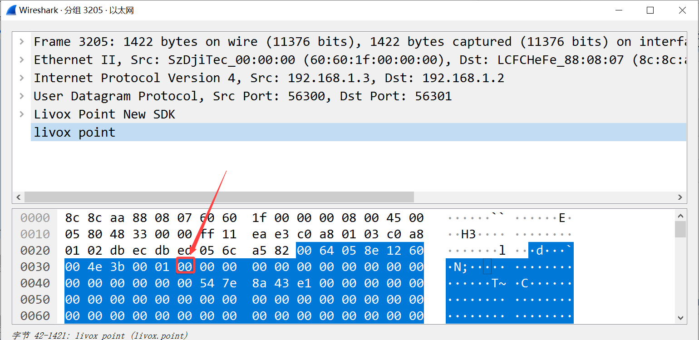
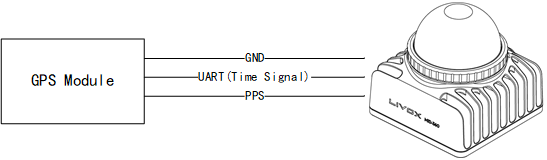
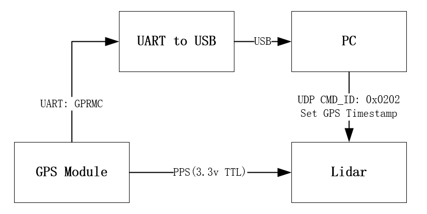

.. _Time Synchronization:

===========================================
Time Synchronization Instructions
===========================================

The synchronization methods supported by different products are different, and the synchronization methods supported by each product are detailed in the description of each product page.

Application Scenarios of Various Time Synchronization Methods
------------------------------------------------------------------------

**(Recommend)PTP/gPTP:**

PTP v2 and gPTP can be used for time synchronization between Livox LiDAR and other devices without GPS and PPS hardware signals. This method requires the least external hardware support, and only needs to have a master clock device in the entire network.

**GPS:**

In the case that other sensors are directly synchronized through GPS signals, the synchronization can be completed by directly connecting the hardware to the PPS signal and GPS signal, without additional software deployment;

.. _PTP Time Synchronization:

PTP Time Synchronization
--------------------------------------------------

Principle of PTP Time Synchronization
~~~~~~~~~~~~~~~~~~~~~~~~~~~~~~~~~~~~~~~~~~~~~~~~~~

The synchronization process uses the Delay request-response mechanism (two steps) of IEEE 1588v2.0 PTP.
The Livox device acts as a slave and performs ptp time synchronization with the master clock device.

.. figure:: ../../../image/timesync/ptp_1588.png
   :alt: image

The master and slave clocks interact with the Sync, Follow_Up, Delay_Req, and Delay_Resp data packets to obtain the time t1, t2, t3, and t4. The transmission delay and the offset of the two clocks are obtained through the following calculations:

Transmission delay:

.. math:: Delay = [(t4 – t1) – (t3 – t2)]/2

Time offset:

.. math:: Offset = (t2 - t1) - Delay = [(t2 – t1) + (t3 – t4)]/2

PTP Time Synchronization Method
~~~~~~~~~~~~~~~~~~~~~~~~~~~~~~~~~~~~~~~~~~~~~~~~~~~~

When Livox LiDAR is connected to a network with a PTP master clock, the device will automatically synchronize its own time to the master clock.

**Step 1: Check whether the master clock in the network is normal: **

For the method of configuring the main clock on the PC, please refer to the appendix :ref:`How to configure the PTP master clock`

If there are two data of Sync and Follow_Up in the network, it means that the PTP master clock source exists and works normally:

.. figure:: ../../../image/timesync/wireshark_ptp.png
   :alt: image

**Step 2: Connect Livox device**

You can connect Livox LiDAR normally through a network cable, no additional wiring is required.

**Step 3: How to view the device is using PTP synchronization**

1. By viewing the timestamp_type data in the point cloud data packet header (see the product communication protocol for details)

If timestamp_type is 1, it means that the device is performing PTP time synchronization：

+----------------+-----------+-------------+
| timestamp_type | data_type |  time type  |
+================+===========+=============+
| 1              | uint64_t  | ns          |
+----------------+-----------+-------------+

2. Or view the Sync Type in the "Settings" option in the Livox Viewer host computer

.. note::
   1. PTP synchronization has the highest priority. When PTP or GPS are available at the same time, PTP network synchronization will be used first;
   2. The network environment with multiple master clocks is not supported;

.. _gPTP Time Synchronization:

gPTP Time Synchronization
----------------------------------------

Principle of gPTP Time Synchronization
~~~~~~~~~~~~~~~~~~~~~~~~~~~~~~~~~~~~~~~~~~~~~

In the "Specification of Time Synchronization over Ethernet" standard of AUTOSAR, corresponding special requirements are made for the application of IEEE 802.1AS in the vehicle field, forming the AUTOSAR Time Sync over Ethernet standard.

Such as:

- Cancel the Announce message in the network;
- BMCA algorithm is not supported;
- The master side does not send delay_req message;
- …

and other requirements.

The Livox LiDAR time synchronization protocol and functions also comply with the requirements of the above standards, and the synchronization process follows the IEEE 802.1AS standard, where the domain controller acts as the master and the Livox device acts as the slave.

.. image:: ../../../image/timesync/ptp.bmp

In the above way, the transmission delay is calculated: link_delay = [(t4 - t1) – (t3 - t2)] / 2

.. image:: ../../../image/timesync/ptp1.bmp

Calculate time offset by Sync, Followup: Offset = (t2’ - t1’) - link_delay

gPTP Time Synchronization Method
~~~~~~~~~~~~~~~~~~~~~~~~~~~~~~~~~~~~~~~~~~~~~~~~

**Step 1: Check whether the master clock in the network is normal:**

For the method of configuring the main clock on the PC, please refer to the appendix :ref:`How to configure the PTP master clock`;

If there are \ ``Sync``\ and \ ``Follow_Up``\ data in the network, it means that the gPTP master clock source exists and works normally:

.. image:: ../../../image/timesync/sync.png

**Step 2: Connect Livox device**

You can connect Livox LiDAR normally through a network cable, no additional wiring is required.

**Step 3: How to check whether the device is using gPTP time synchronization**

Same as PTP, there is no distinction between PTP synchronization or gPTP time synchronization in the device status.

.. _How to configure the PTP master clock:

Appendix: How to configure the PTP master clock
~~~~~~~~~~~~~~~~~~~~~~~~~~~~~~~~~~~~~~~~~~~~~~~~~~

refer to: `The Linux PTP Project <http://linuxptp.sourceforge.net>`__

Download: 

   This method has been tested and is recommended to use `linuxptp v3.1.1 <https://sourceforge.net/projects/linuxptp/files/v3.1/linuxptp-3.1.1.tgz/download>`__
   
   You can also use git clone (not recommended)
.. code:: bash

   git clone http://git.code.sf.net/p/linuxptp/code linuxptp

Compile and install:

.. code:: bash

   cd linuxptp
   make
   sudo make install

If you want ptp4l to work normally, you need the system's Linux kernel version 3.0 or higher. Use the following command to check whether the network card supports software/hardware timestamp function (for example: query the status of network card 'eth0').

.. code:: bash

   ethtool -T eth0

The network card capabilities option includes the following parameters, indicating that the network card supports software timestamps:

.. code:: bash

   SOF_TIMESTAMPING_SOFTWARE
   SOF_TIMESTAMPING_TX_SOFTWARE
   SOF_TIMESTAMPING_RX_SOFTWARE

The network card capabilities option includes the following parameters, indicating that the network card supports hardware timestamps:

.. code:: bash
   
   SOF_TIMESTAMPING_RAW_HARDWARE
   SOF_TIMESTAMPING_TX_HARDWARE
   SOF_TIMESTAMPING_RX_HARDWARE

The example in the figure below shows that the eth0 network card supports hardware timestamps.

.. figure:: ../../../image/timesync/ptp_support.png
   :alt: image

In the example below, the wlan0 network card does not support hardware and software timestamps, and linuxptp/ptp4l cannot work normally.

Run the following command to start the ptp4l master clock function in PTP mode:

.. code:: bash

   sudo ptp4l -i eth0 -l 6 -m

Run the following command to start the ptp4l master clock function using the gPTP mode software timestamp:

.. code:: bash

   sudo ptp4l -i eth0 -S -ml 6 -f automotive-master.cfg

Run the following command to start the ptp4l master clock function using the gPTP mode hardware timestamp:

.. code:: bash

   sudo ptp4l -i eth0 -H -ml 6 -f automotive-master.cfg  

If ``Sync Message`` data appears in the network, it means that the master clock function of the ptp4l program is running normally:

.. figure:: ../../../image/timesync/wireshark_ptp.png
   :alt: image

You can use the following command to synchronize the system time with the PTP hardware clock:

For more information, please refer to
`phc2sys link <http://manpages.ubuntu.com/manpages/cosmic/man8/phc2sys.8.html>`__

.. code:: bash

   sudo phc2sys -c eth0 -s CLOCK_REALTIME -O 0

After completing the above steps, the LiDAR time and PC local system time can be synchronized through ptp4l.

.. _GPS Time Synchronization:

GPS Time Synchronization
-------------------------------

Principle of GPS Time Synchronization
~~~~~~~~~~~~~~~~~~~~~~~~~~~~~~~~~~~~~~~~~~~~

The PPS port of the GPS clock source sends a hardware pulse (PPS signal) every second, and then the data port sends time information (GPRMC format) corresponding to the rising edge of this pulse.

After receiving the rising edge of the PPS signal and analyzing the correct time information from the GPRMC data, the Livox device will set the point cloud time as the GPS time, and keep this time base for continuous accumulation to achieve time synchronization with the GPS device.

.. figure:: ../../../image/timesync/gps_sync.png
   :alt: image

Timing requirements for PPS signal and GPRMC signal:

+------+---------------------------------------------------------------------------------+-------------------+-------------------+
| time | description                                                                     | effective range   | recommended value |
+======+=================================================================================+===================+===================+
| t0   | The interval between the rising edges of two adjacent second pulses             |  900 ms ~  1100ms |    1000 ms        |
+------+---------------------------------------------------------------------------------+-------------------+-------------------+
| t1   | High level time of the second pulse                                             |    > 1us          |    10 ms ~ 200 ms |
+------+---------------------------------------------------------------------------------+-------------------+-------------------+
| t2   | Transmission time of GPRMC (baud rate: 9600bps)                                 |    ≈ 70 ms        |    70 ms          |
+------+---------------------------------------------------------------------------------+-------------------+-------------------+
| t3   | The delay of GPRMC data start sending relative to the rising edge of the pulse  |    0 ms ~ 900 ms  |    0 ms ~ 430 ms  |
+------+---------------------------------------------------------------------------------+-------------------+-------------------+

.. note::
   The slope of PPS pulse is recommended to be greater than 1V/us

GPS time synchronization method
~~~~~~~~~~~~~~~~~~~~~~~~~~~~~~~~~~~~~~~~~~~~~~~~~

In order to be compatible with other manufacturers' LiDAR hardware, Livox devices also support GPS time synchronization.

The following takes Mid-360 as an example to introduce two ways of using GPS synchronization:

1. (recommended)Synchronization via Uart: Lidar hardware is connected to PPS pulse signal, and Lidar hardware is connected to GPRMC Uart signal;
2. Synchronization via Ethernet: the hardware accesses the PPS pulse signal, and sends the GPRMC signal to Lidar through UDP packets;

Synchronization via Uart
^^^^^^^^^^^^^^^^^^^^^^^^^^^^^^^^^^^^

**Hardware connection**

If the UART output signal and PPS signal of the GPS module are at TTL (3.3v) level, directly connect the two signal lines to the corresponding external pins of the Mid360 (pin 8 "second pulse" and pin 10 "GPS input" pin), and the corresponding pin sequence of Mid360 can be found in "Livox Mid-360 User Manual";

Otherwise, the Uart signal and PPS signal need to be converted to TTL (3.3v) level before they can be connected to the corresponding pins of Mid-360.

.. note::
   1. Adopt Uart mode, no need to configure SDK software;
   2. Pay special attention to the hardware access voltage, otherwise it will cause equipment damage;
   3. GPS Uart needs to be configured as: baud rate 9600, data bit 8bit, no parity;
   4. The content output by GPS Uart needs to contain GPRMC or GNRMC information;
   5. Pay attention to the signal quality of hardware wiring, which will seriously affect the stability and accuracy of synchronization.

Synchronization via Ethernet(not recommended)
^^^^^^^^^^^^^^^^^^^^^^^^^^^^^^^^^^^^^^^^^^^^^^^^^^^

If the GPRMC signal output by the GPS module is connected to the host computer (PC or industrial computer), after the host computer parses the time information, it can send UDP packets according to the control command protocol to set the GPS time stamp for the device;

**How to view the device is using GPS synchronization**

1. By viewing the timestamp_type data in the point cloud data packet header (see the product communication protocol for details)

If timestamp_type is 2, it means that the device is performing GPS time synchronization:

+----------------+-----------+------------+
| timestamp_type | data_type | time type  |
+================+===========+============+
| 2              | uint64_t  |    ns      |
+----------------+-----------+------------+

2. Or in the Livox Viewer host computer, view the Sync Type of the "Settings" option;

.. note::
   Normally, the GPS module can output PPS signal and time signal normally only after receiving GPS signal. When using, it is necessary to ensure that the GPS signal is stable; currently the time signal only supports the two formats of GPRMC/GNRMC;
