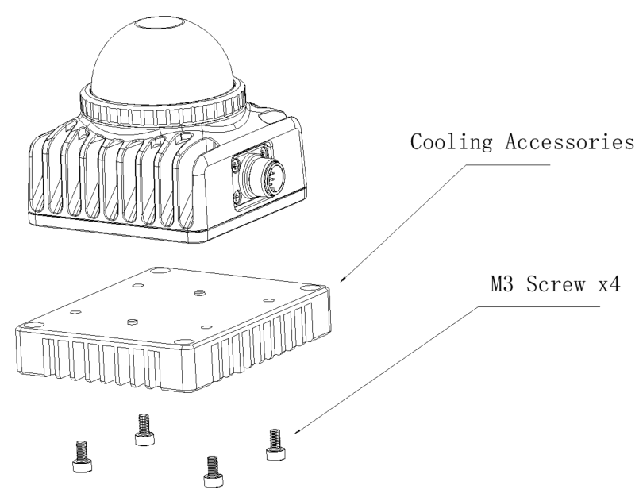
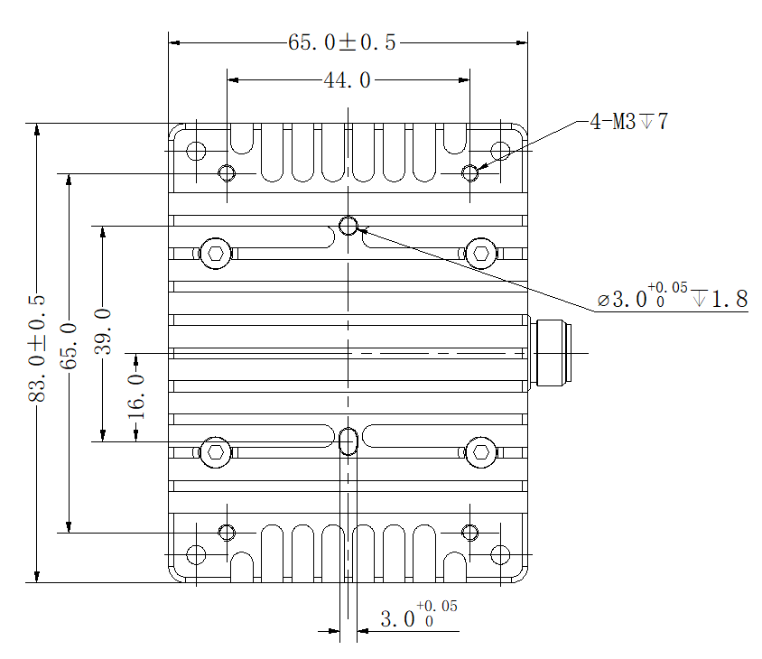
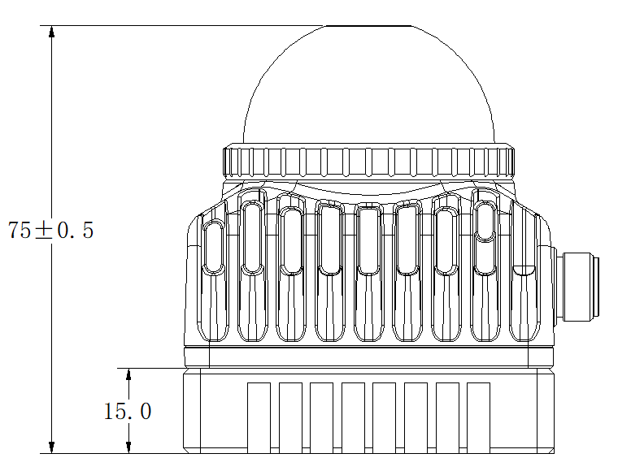
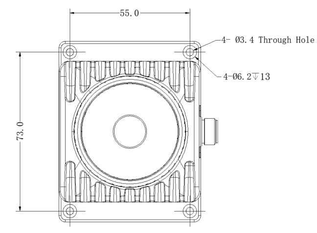
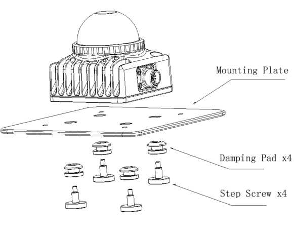
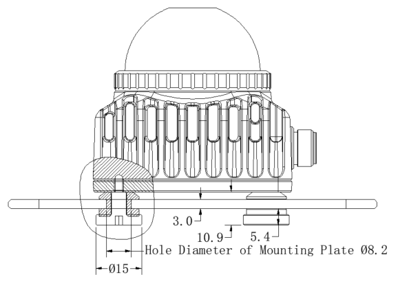

# Cooling accessories

Users can purchase cooling accessories to meet the needs of working in a 60℃ environment.

## Cooling accessories installation method

## Cooling accessories installation dimensions

# Vibration reduction accessories
If it is found that there is a large vibration and noise problem when installed on the user's base, which is more obvious than the vibration and noise of the radar itself, it may be that the resonance amplification effect of the radar and the installation structure has occurred. In addition to adjusting the installation structure mode to avoid resonance amplification, you can also purchase Livox vibration reduction accessories to optimize vibration and noise problems. The vibration reduction structure and installation diagram are shown in the figure below.

## Vibration reduction accessories installation method

## Vibration reduction accessories installation dimensions

**Related design drawings：**

- [Vibration reduction design drawing 1](./images/cushioning_design0.jpg)

- [Vibration reduction design drawing 2](./images/cushioning_design1.jpg)

This document only provides design reference. Specific component groups need to be produced by users according to actual scene requirements.

## Precautions for vibration reduction accessories

1. The installation base is only an installation diagram and is not included in the accessories.

2. Vibration-absorbing pads and step screws can be used in conjunction with the above-mentioned heat dissipation accessories.

3. The upper end of the vibration damping pad is chamfered and can be directly deformed and pressed in from the bottom of the mounting plate. It is recommended that the diameter of the contact surface between the mounting base and the vibration damping pad be greater than 15mm.

4. The mode of the installation structure should avoid resonance with the vibration reduction structure, otherwise the vibration reduction effect will not be achieved. It is recommended that customers test and confirm the vibration reduction effect before officially introducing it for use.

5. After using the vibration-absorbing installation structure, the external parameter fluctuations of the radar will be larger than those directly connected. This is only recommended for customers who are not sensitive to external parameter fluctuations.