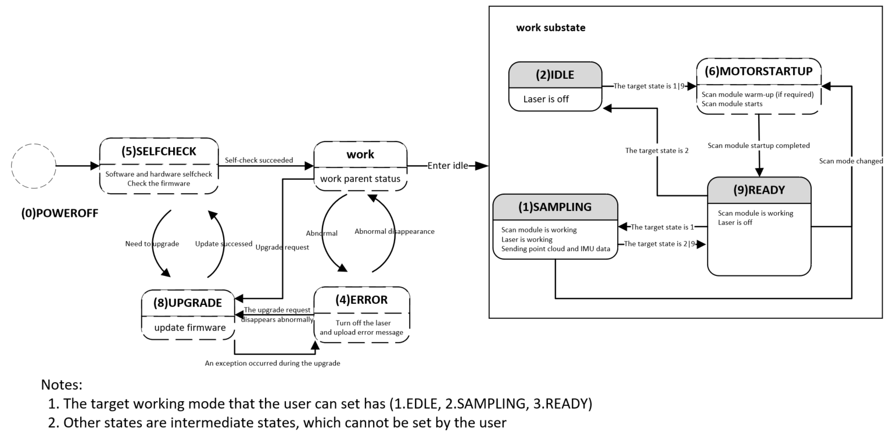
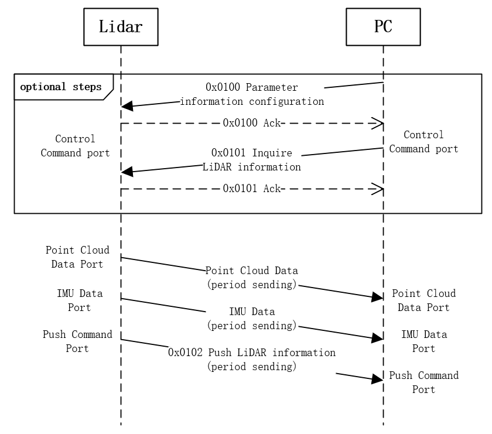

# Livox LiDAR Communication Protocol--Mid360

| **Release History** |             |                                                              |
| ------------------- | ----------- | ------------------------------------------------------------ |
| **Date**            | **Version** | **Description**                                              |
| 20220519            | v1.0        | 1. Initialized version                                       |
| 20220530            | v1.1        | 1. Merge status and parameter `key_value` information fields 2. The information push command supports pushing LiDAR parameter information and status information |
| 20220602            | v1.2        | 1. Add `log` related commands                                |
| 20220622            | v1.3        | 1. Port 56000 only supports discovery command by broadcasting. Discovery command by broadcasting `ack` adds the control command port field of the current LiDAR |
| 20220628            | v1.4        | 1. Update working status description                         |
| 20220629            | v1.4.1      | 1. Add `firmware type` to `key value list`                   |
| 20220815            | v1.4.2      | 1. Add `detect_mode & func_io_cfg` to `key value list`       |
| 20220825            | v1.4.3      | 1.Add `tag_type` to the point cloud frame header to describe the type of point cloud `tag` 2.Added description of `tag` type |
| 20220915            | v1.4.4      | 1.Add point cloud format description in spherical coordinate system 2.Modified description of ROI configuration |
| 20221028            | v1.4.5      | 1. Modified description of FOV configuration 2. Modified description of GPS time synchronization |
| 20221114            | v1.4.6      | 1. Add description  of communication process                 |
| 20221213            | v1.4.7      | 1. Modified description of pattern_mode configuration        |
| 20230904            | v1.4.8      | 1. Add description of log related protocols                  |
| 20240102            | v1.4.9      | 1. Add upgrade error related abnormal code description 2. Add environment temp related high abnormal code|
| 20240117            | v1.4.10     | 1. Update description of GPS sync high-level time of the second pulse|

# Overview

This communication protocol is only used for livox Mid360 LiDAR.

## Protocol Types

There are two types of data protocols between the user and the LiDAR, see as below:

**Point cloud data protocol:**

- Point cloud data;

- IMU data.

  For details, see [2.3 Data Types](#2.3-Data-Types).

**Control command protocol:**

- Configure and query LiDAR parameters;

- LiDAR reset;

- Push and query LiDAR status;

- Upgrade LiDAR;

  For details, see [4 CMD Detials](#4-CMD-Detials)
  

Both protocols are encapsulated using UDP data segments, and the protocol data is **Little-endian**.

## LiDAR Working Status

The state machine of the current LiDAR is shown in the figure, The state enumeration values currently used by the Mid360 are as follows:

| LiDAR Status | Enumeration Value | Whether to Support User Settings    |
| ------------ | ----------------- | ----------------------------------- |
| SAMPLING     | 0x01              | Support(By Parameter Configuration) |
| IDLE         | 0x02              | Support(By Parameter Configuration) |
| ERROR        | 0x04              | Not Support                         |
| SELFCHECK    | 0x05              | Not Support                         |
| MOTORSTARUP  | 0x06              | Not Support                         |
| UPGRADE      | 0x08              | Support(By Entering Upgrade)        |
| READY        | 0x09              | Support(By Parameter Configuration) |

## Port Description

The source port and destination port are explained as follows according to the different data types:

| Data Type         | Transmission Direction | LiDAR Port | Host Computer Port | Transmission Type | Transmission Protocol |
| ----------------- | ---------------------- | ---------- | ------------------ | ----------------- | --------------------- |
| Device Type Query | LiDAR <----> PC        | 56000      | Any                | Broadcast         | UDP                   |

**56000 is used as the fixed listening port of Livox LiDAR, mainly used for the host computer to query the device through broadcast:**

**1. Only the device type query command (cmd_id: 0x0000) is supported. The host computer obtains the specific device type of the LiDAR through this port. This command response is replied by broadcast, so that when the host computer and the LiDAR IP are not in the same network segment, the host computer can still identify the LiDAR**.

Mid-360 Communication Port:

| Data Type        | Transmission Direction    | LiDAR Port | Host Computer Port           | Transmission Type | Transmission Protocol |
| ---------------- | ------------------------- | ---------- | ---------------------------- | ----------------- | --------------------- |
| Control Command  | LiDAR<---> Host Computer  | 56100      | Any (56101 recommended)      | Unicast           | UDP                   |
| Push Command     | LiDAR ---> Host Computer  | 56200      | Configurable (default 56201) | Default Unicast   | UDP                   |
| Point Cloud Data | LiDAR ---> Host Computer  | 56300      | Configurable (default 56301) | Default Unicast(Support Multicast)   | UDP                   |
| IMU Data         | LiDAR ---> Host Computer  | 56400      | Configurable (default 56401) | Default Unicast(Support Multicast)   | UDP                   |
| LOG Data         | LiDAR <---> Host Computer | 56500      | Any (56501 recommended)      | Unicast           | UDP                   |

# Point Cloud & IMU Data Protocol

## Protocol Format

Point cloud data format:

| Fields        | Offset (bytes) | Size (bytes) | Description                              |
| ------------- | -------------- | ------------ | ---------------------------------------- |
| version       | 0              | 1            | Package protocol version: currently 0.   |
| length        | 1              | 2            | The length of the entire UDP data segment starting from `version`. |
| time_interval | 3              | 2            | Intra-frame point cloud sampling time (Unit: 0.1us); In this frame of point cloud data, the time of the last point minus the time of the first point. |
| dot_num       | 5              | 2            | The current UDP packet data field contains the number of points. |
| udp_cnt       | 7              | 2            | Point cloud UDP packet count, each UDP packet is incremented by 1 in turn, and cleared to 0 at the beginning of the point cloud frame. |
| frame_cnt     | 9              | 1            | Point cloud frame count, plus 1 for each frame of point cloud (10Hz/15Hz, etc.); For non-repeating scans, this field is invalid. |
| data_type     | 10             | 1            | Data type. For details, see [2.3 Data Types](#2.3-Data-Types). |
| time_type     | 11             | 1            | Timestamp type. For details, see [2.2 Timestamp](#2.2-Timestamp). |
| reserved      | 12             | 12           | Reserved.                                |
| crc32         | 24             | 4            | Timestamp + data segment check code, using CRC-32 algorithm. For details, see [6 CRC Algorithm](#6-CRC-Algorithm). |
| timestamp     | 28             | 8            | Point cloud timestamp. For details, see [2.2 Timestamp](#2.3-Timestamp). |
| data          | 36             | --           | Data information. For details, see [2.3 Data Types](#2.3-Data-Types). |

## Timestamp

The LiDAR system supports GPS time synchronization and PTP network time synchronization.

GPS time synchronization can be input through UDP packets, or through serial port GPRMC packets, see the time synchronization documentation for more details;

PTP time synchronization supports IEEE1588v2.0 UDP/IP synchronization, and gPTP L2 synchronization;

The timestamp in each packet represents the time of the first point cloud, and there are N point clouds in each packet. The time of these N point clouds is equally spaced, and the total time interval is the value of `time_interval`.

Timestamp type:

| Timestamp Type | Sync Source Type                                             | Data Format | Description |
| -------------- | ------------------------------------------------------------ | ----------- | ----------- |
| 0              | No synchronization source, the timestamp is the time when the LiDAR is turned on | uint64_t    | Unit: ns    |
| 1              | gPTP/PTP synchronization, the time of master clock source as a timestamp | uint64_t    | Unit: ns    |
| 2              | GPS time synchronization                                     | uint64_t    | Unit: ns    |

Notice:

* The time limit for GPS time synchronization is from 1/1/2000 to 31/12/2037
* PTP time synchronization does not support IEEE1588v2.1
* Not recommended for use in scenarios where IEEE1588v2.0 and gPTP coexist;

## Data Types

There are N samples in each packet. The size of N depends on the data type.

There are four data types from 0 to 3, the default data type is 1:

| Data Type | Sampling Type      | Echo Mode        | Coordinate Mode              | N                  |
| --------- | -----------------  | ---------------- | ---------------------------- | ------------------ |
| 0         | IMU data           |                  |                              |                    |
| 1         | Point cloud data 1 | Single echo mode | Cartesian coordinates(32bit) | 96                 |
| 2         | Point cloud data 2 | Single echo mode | Cartesian coordinates(16bit) | 96                 |
| 3         | Point cloud data 3 | Single echo mode | Spherical coordinates        | 96                 |

**Data Type 0**

IMU Data:

| Field  | Offset (bytes) | Data Type | Description |
| ------ | -------------- | --------- | ----------- |
| gyro_x | 0              | float     | Unit: rad/s |
| gyro_y | 4              | float     | Unit: rad/s |
| gyro_z | 8              | float     | Unit: rad/s |
| acc_x  | 12             | float     | Unit: g     |
| acc_y  | 16             | float     | Unit: g     |
| acc_z  | 20             | float     | Unit: g     |

**Data Type 1**

Single echo Cartesian coordinate data format:

| Field        | Offset (bytes) | Data Type | Description                              |
| ------------ | -------------- | --------- | ---------------------------------------- |
| x            | 0              | int32_t   | X axis, Unit: mm                         |
| y            | 4              | int32_t   | Y axis, Unit: mm                         |
| z            | 8              | int32_t   | Z axis, Unit: mm                         |
| Reflectivity | 12             | uint8_t   | Reflectivity                             |
| Tag          | 13             | uint8_t   | According to the point cloud frame header `pack_info.tag_type` field, match the specific tag type. For details, see [2.4 Tag Information](#2.4-Tag-Information). |

**Data Type 2**

Single echo Cartesian coordinate data format (16bit): 
| Field        | Offset (bytes) | Data Type | Description (10mm is the resolution in 16bit format) |
| ------------ | -------------- | --------- | ---------------------------------------- |
| x            | 0              | int16_t   | X axis, Unit: 10mm                       |
| y            | 2              | int16_t   | Y axis, Unit: 10mm                       |
| z            | 4              | int16_t   | Z axis, Unit: 10mm                       |
| Reflectivity | 6              | uint8_t   | Reflectivity                             |
| Tag          | 7              | uint8_t   | According to the point cloud frame header `pack_info.tag_type` field, match the specific tag type. For details, see [2.4 Tag Information](#2.4-Tag-Information). |

**Data Type 3**

Single return spherical coordinate data format: 
| Field        | Offset (bytes) | Data Type | Description (10mm is the resolution in 16bit format) |
| ------------ | -------------- | --------- | ---------------------------------------- |
| depth        | 0              | uint32_t  | Depth, Unit: mm                          |
| theta        | 4              | uint16_t  | Zenith angle[0, 18000], Unit: 0.01 degree |
| phi          | 6              | uint16_t  | Azimuth[0, 36000], Unit: 0.01 degree     |
| Reflectivity | 8              | uint8_t   | Reflectivity                             |
| Tag          | 9              | uint8_t   | According to the point cloud frame header `pack_info.tag_type` field, match the specific tag type. For details, see [2.4 Tag Information](#2.4-Tag-Information). |

## Tag Information

Tag mainly indicates other additional information of the detection point.The point cloud is marked as an 8bit unsigned integer, which is divided into several areas according to the bit, and each area represents an attribute of the detection point, including rain, fog, dust, adhesion point clouds between similar objects, etc.; Among them, the confidence level indicates the reliability of the detection point, and the normal point is generally 0 (High confidence); Low confidence indicates that the detection point is greatly affected by the corresponding attributes, and the reliability of the detection result is poor; if necessary, the point cloud can be filtered based on this information.Details are as follows:

| Bit      | Description                              |
| -------- | ---------------------------------------- |
| bit 6~7 | Reserved                                                       |
| bit 4~5 | Properties of Detection Points: other 0: High confidence (normal point) 1: Medium confidence 2: Low confidence 3: Reserved |
| bit 2~3 | Properties of Detection Points: Rain, fog, dust and other tiny particles 0: High confidence (normal point) 1: Medium confidence 2: Low confidence 3: Reserved |
| bit 0~1 | Properties of Detection Points: Glue point cloud between adjacent objects 0: High confidence (normal point) 1: Medium confidence 2: Low confidence 3: Reserved |

# Control Command

## Frame Format

Format of control command is as follows:

| Field       | Offset(byte) | Size (byte) | Description                              |
| ----------- | ------------ | ----------- | ---------------------------------------- |
| sof         | 0            | 1           | Starting byte, fixed to be 0xAA.         |
| version     | 1            | 1           | Protocol version, 0 for current version. |
| length      | 2            | 2           | Length of frame;  The number of bytes from beginning of `sof` to end of entire `data` segment. Max value: 1400. |
| seq_num     | 4            | 4           | This field is incremented by 1 for each new REQ request message;  This field of ACK message is the same as REQ and can be used for message matching. |
| cmd_id      | 8            | 2           | Different types of messages are distinguished by this field, For details, see [5 Return Code Description](#5-Return-Code-Description). |
| cmd_type    | 10           | 1           | Command Type:  0x00: REQ, actively send data request; 0x01: ACK, response to REQ data. |
| sender_type | 11           | 1           | The sender's device type:  0x00: Host computer,  0x01: LiDAR. |
| resv        | 12           | 6           | Reserved.                                |
| crc16       | 18           | 2           | Frame header checksum, check data starts from sof to crc16 (not included), 18 bytes in total. For details, see [6 CRC Algorithm](#6-CRC-Algorithm). |
| crc32       | 20           | 4           | Frame data checksum. For details, see [6 CRC Algorithm](#6-CRC-Algorithm); When length of data field is 0, CRC32 needs to be padded with 0. |
| data        | 24           | n           | [4 CMD detials](#4-CMD-detials).           |

## Command ID

Command id list: 

| Function Type      | CMD ID | Function                                  |
| ------------------ | ------ | ------------------------------------------|
| Device Type Query  | 0x0000 | Discovery by broadcasting                 |
|                    |        |                                           |
| LiDAR Information  | 0x0100 | Parameter information configuration       |
|                    | 0x0101 | Inquire LiDAR information                 |
|                    | 0x0102 | Push LiDAR information                    |
|                    |        |                                           |
| Control CMD        | 0x0200 | Request reboot device                     |
|                    | 0x0201 | Restore factory settings                  |
|                    | 0x0202 | Set GPS timestamp                         |
|                    |        |                                           |
| log CMD            | 0x0300 | Log file push                             |
|                    | 0x0301 | Log collection configuration              |
|                    | 0x0302 | Log system time synchronization           |
|                    | 0x0303 | Debug raw data collection configuration   |
|                    |        |                                           |
|                    |        |                                           |
| General Uprade CMD | 0x0400 | Request to start upgrade                  |
|                    | 0x0401 | Firmware data transfer                    |
|                    | 0x0402 | Firmware transfer complete                |
|                    | 0x0403 | Get firmware upgrade status               |

## Communication Process

# CMD Detials

## Device Type Query

### 0x0000 Discovery By Broadcasting

Request

| CMD  | Name | Offset(byte) | Data Type | Description |
| ---- | ---- | ------------ | --------- | ----------- |
| data | NULL |              |           |             |

ACK

| ACK  | Name          | Offset(byte) | Data Type   | Description                              |
| ---- | ------------- | ------------ | ----------- | ---------------------------------------- |
| data | ret_code      | 0            | uint8_t     | Return code  (For details, see [5 Return Code Description](#5-Return-Code-Description) ) |
|      | dev_type      | 1            | uint8_t     | LiDAR type                               |
|      | serial_number | 2            | uint8_t[16] | LiDAR SN                                 |
|      | lidar_ip      | 18         | uint8_t[4]  | LiDAR IP address  E.g: AA.BB.CC.DD  lidar_ip[0] = AA  lidar_ip[1] = BB  lidar_ip[2] = CC  lidar_ip[3] = DD |
|      | cmd_port      | 22         | uint16_t    | LiDAR command port        |

## LiDAR Information

### 0x0100 Parameter Configuration

Request

| CMD  | Name           | Offset(byte) | Data Type         | Description                              |
| ---- | -------------- | ------------ | ----------------- | ---------------------------------------- |
| data | key_num        | 0            | uint16_t          | Number of key in `key_value_list`        |
|      | rsvd           | 2            | uint16_t          | Reserved                                 |
|      | key_value_list | 4            | key_value_list[N] | `Key` list  For convenience of expansion, multiple pieces of information are placed in a variable-length `key_value_list` |

Format of each parameter in `key_value_list` is as follows: 

| Data Field | Offset(byte) | Data Type | Description                 |
| ---------- | ------------ | --------- | --------------------------- |
| key        | 0            | uint16_t  | Key number, see table below |
| length     | 2            | uint16_t  | Length of value to the key  |
| value      | 4            | --        | Value content to the key    |

ACK

| ACK  | Name      | Offset(byte) | Data Type | Description                              |
| ---- | --------- | ------------ | --------- | ---------------------------------------- |
| data | ret_code  | 0            | uint8_t   | Return code  (For details, see [5 Return Code Description](#5-Return-Code-Description) ) |
|      | error_key | 1          | uint16_t | If the `ret_code` is not `LVX_RET_SUCCESS`, the `error_key` shows which key is error |

### 0x0101 Parameter Inquire

Request

| CMD  | Name     | Offset(byte) | Data Type | Description                 |
| ---- | -------- | ------------ | --------- | --------------------------- |
| data | key_num  | 0            | uint16_t  | Number of key in `key_list` |
|      | rsvd     | 2            | uint16_t  |                             |
|      | key_list | 4            | --        | Key list                    |

The key type in the `key_list`: 

| Data | Offset(byte) | Data Type | Description |
| ---------- | ------------ | --------- | ----------- |
| key        | 0            | uint16_t  | key number  |

ACK

| ACK  | Name           | Offset(byte) | Data Type | Description                              |
| ---- | -------------- | ------------ | --------- | ---------------------------------------- |
| data | ret_code       | 0            | uint8_t   | Return Code (For details, see[5 Return Code Description](#5-Return-Code-Description) ) |
|      | key_num        | 1            | uint16_t  | Number of key in `key_value_list`        |
|      | key_value_list | 3            | --        | Value of key                             |

### 0x0102 LiDAR Information Push

LiDAR push Actively

| CMD  | Name           | Offset(byte) | Data Type | Description                       |
| ---- | -------------- | ------------ | --------- | --------------------------------- |
| data | key_num        | 0            | uint16_t  | Number of key in `key_value_list` |
|      | rsvd           | 2            | uint16_t  |                                   |
|      | key_value_list | 4            | --        | Value of key                      |

Format of the `key_value_list` : 

| Data Field | Offset(byte) | Data Type | Description                 |
| ---------- | ------------ | --------- | --------------------------- |
| key        | 0            | uint16_t  | key number, see table below |
| length     | 2            | uint16_t  | Length of value to the key  |
| value      | 4            | --        | Value content to the key    |

Specific meanings to `key_value_list` are as follows:

| Number(key) | Name                  | Length | Type        | Content                                                      | Support Parameter Information Configuration Command(cmd_id=0x0100) |
| ----------- | --------------------- | ------ | ----------- | ------------------------------------------------------------ | ------------------------------------------------------------ |
| 0x0000      | pcl_data_type         | 1      | uint8_t     | Type of point cloud data, For details, see[Data Types](2.3 Data Types)  0x01: Cartesian coordinate(32bits) 0x02: Cartesian coordinate(16bits) 0x03: Spherical coordinate | Yes                                                          |
| 0x0001      | pattern_mode          | 1      | uint8_t     | Pattern mode  0x00: Non-repetitive scan 0x01: Repetitive scan(Not Support Now) 0x02: Low frame rate Repetitive scan(Not Support Now) Note:  Repetitive scan and Low frame rate Repetitive scan are not supported now, it is invalid after setting, please pay attention continuous firmware version update; | Yes                                                          |
| 0x0004      | lidar_ipcfg           | 12     | uint8_t[12] | LiDAR IP address configuration LiDAR IP address: AA.BB.CC.DD     data[0]: AA     data[1]: BB     data[2]: CC     data[3]: DD IPV4 subnet mask     data[4-7] IPV4 gateway     data[8-11] | Yes                                                          |
| 0x0005      | state_info_host_ipcfg | 8      | uint8_t[8]  | IP address configuration for pushing LiDAR status information data[0-3]: Destination address: AA.BB.CC.DD data[4-5]: Destination port data[6-7]: Source port  | Yes                                                          |
| 0x0006      | pointcloud_host_ipcfg | 8      | uint8_t[8]  | IP address configuration for pushing LiDAR point cloud data data[0-3]: Destination address: AA.BB.CC.DD data[4-5]: Destination port data[6-7]: Source port  | Yes                                                          |
| 0x0007      | imu_host_ipcfg        | 8      | uint8_t[8]  | IP address configuration for pushing LiDAR IMU data data[0-3]: Destination address: AA.BB.CC.DD data[4-5]: Destination port data[6-7]: Source port  | Yes                                                          |
| 0x0012      | install_attitude      | 24     |             | Installation location of LiDAR on user device. Assigned by user, this information is carried in command and point cloud data, not processed by LiDAR. Format {     float roll_deg;     float pitch_deg;     float yaw_deg;     int x_mm;     int y_mm;     int z_mm; } | Yes                                                          |
| 0x0015      | fov_cfg0              | 20     |             | FOV configuration, if you do not need to use all the FOV, you can delineate an area (angle range) on the FOV sphere, the lidar only samples in this area, other areas do not work, you can configure two such areas independently, except for the configuration In addition to this parameter, the configuration needs to be enabled through fov_cfg_en; this is the configuration of the first working area, and its format is as follows: struct{     int32_t yaw_start; //Start angle of yaw, range is [0°-360°)     int32_t yaw_stop; //End angle of yaw, range is [0°-360°)     int32_t pitch_start; //Start angle of pitch, range is(-10°-60°)     int32_t pitch_stop; //End angle of pitch, range is (-10°-60°)      uint32_t rsvd;  //Reserved }; Note:  1. In addition to this configuration, the actual light-emitting area also needs to consider the actual FOV limit range of the device; 2. In order to avoid the time synchronization problem, the points outside the FOV will still be in the point cloud package, the detection distance is 0, and the reflectivity is 60; | Yes                                                          |
| 0x0016      | fov_cfg1              | 20     |             | Same as fov_cfg0, this is the configuration of the second working area | Yes                                                          |
| 0x0017      | fov_cfg_en            | 1      | uint8_t     | Dividing the enable of different regions by bit Bit 0: 1 means fov_cfg0 is valid, 0 means invalid Bit 1: 1 means fov_cfg1 is valid, 0 means invalid | Yes                                                          |
| 0x0018      | detect_mode           | 1      | uint8_t     | Detect mode 0x00: Normal 0x01: Sensitive Note: Sensitive detection mode enhances detection ability of objects with low reflectivity, and has better detection results for extremely dark or bright surfaces, but may slightly increase noise rate at the same time. | Yes                                                          |
| 0x0019      | func_io_cfg           | 4      | uint8_t[4]  | Function IO configuration. Bytes 0-3 represent functions of IN0, NI1, OUT0, and OUT1 pins respectively, corresponding Mid-360 M12 pin numbers are 8, 10, 12, and 11. IN0: Default value is 0, which means it is used to connect to PPS input, other values are invalid IN1: Default value is 0, which means it is used to connect to GPS input, other values are invalid OUT0: Default value is 0, which means no output (external pull-up resistor), a value of 1 means following the IN0 signal, a value of 2 means the safety zone function outputs 0, and other values are invalid. OUT1: Default value is 0, which means no output (external pull-up resistor), a value of 1 means following the IN1 signal, a value of 2 means the safety zone function outputs 1, and other values are invalid | Yes                                                          |
| 0x001A      | work_tgt_mode         | 1      | uint8_t     | LiDAR target working mode, For details, see[1.2 LiDAR Working Status](#1.2-LiDAR-Working-Status) | Yes                                                          |
| 0x001C      | imu_data_en           | 1      | uint8_t     | 0x00: Disable IMU data push  0x01: Enable IMU data push  | Yes                                                          |
| 0x8000      | sn                    | 16     | uint8_t[16] | String type(Use '\0' padding for less than 16 bits) LiDAR SN(Use '\0' padding for less than 16 bits) | No                                                           |
| 0x8001      | product_info          | 64     | char[64]    | String type(Use '\0' padding for less than 32 bits) LiDAR type + LiDAR production date Example: "Mid-360 2021/12/01" | No                                                           |
| 0x8002      | version_app           | 4      | uint8_t[4]  | App firmware version number: aa.bb.cc.dd version_info[0]: aa version_info[1]: bb version_info[2]: cc version_info[3]: dd | No                                                           |
| 0x8003      | version_loader        | 4      | uint8_t[4]  | Loader firmware version number                               | No                                                           |
| 0x8004      | version_hardware      | 4      | uint8_t[4]  | Hardware version number                                      | No                                                           |
| 0x8005      | mac                   | 6      | uint8_t[6]  | LiDAR MAC address: aa:bb:cc:dd:ee:ff data[0]: aa data[1]: bb data[2]: cc data[3]: dd data[4]: ee data[5]: ff | No                                                           |
| 0x8006      | cur_work_state        | 1      | uint8_t     | Current working state of LiDAR                               | No                                                           |
| 0x8007      | core_temp             | 4      | int32_t     | Core temperature(Unit: 0.01℃)                                | No                                                           |
| 0x8008      | powerup_cnt           | 4      | uint32_t    | Count of LiDAR powerup                                       | No                                                           |
| 0x8009      | local_time_now        | 8      | uint64_t    | Local time of device                                         | No                                                           |
| 0x800A      | last_sync_time        | 8      | uint64_t    | Master time of last synchronization:  If PTP synchronized: this time is t1 time carried in follow_up message If GPS synchronized: this time is PPS rising edge time carried in synchronization command | No                                                           |
| 0x800B      | time_offset           | 8      | int64_t     | Time offset of current local time from synchronization source, unit: ns:  If local time of device is t0 and source time is t1, then `time_offset = t0 - t1` | No                                                           |
| 0x800C      | time_sync_type        | 1      | uint8_t     | Type of time synchronization 0: No time synchronization 1: PTP time synchronization(IEEE 1588v2.0) 2: gps time synchronization  | No                                                           |
| 0x800E      | lidar_diag_status     | 2      | uint16_t    | LiDAR diag status code  Level of module status abnormality:  0: normal  1: warning 2: error 3: safety_err struct diag_status{ bit0-3:  system module(Related to software and hardware of main controller) bit4-7: Scan module(Related to optical path control and angle detection) bit8-11: Ranging module(Related to control of transmit/receive, peripheral circuits, processing of original signals) bit12-15: Communication module(Related to software and hardware of communication, time synchronization) }  | No                                                           |
| 0x8010      | FW_TYPE               | 1      | uint8_t     | Firmware type:  0: loader 1: application_image      | No                                                           |
| 0x8011      | hms_code              | 1      | uint32_t[8] | Diagnostic Trouble Code, Each non-0 value represents a piece of diagnostic information. When the radar does not work normally, the cause of the problem can be confirmed through the diagnostic code |                                                              |

## Control Command    

### 0x0200 Reboot Device

Request

| CMD  | Name    | Offset (byte) | Data Type | Description                  |
| ---- | ------- | ------------- | --------- | ---------------------------- |
| data | timeout | 0             | uint16_t  | Reboot device delay time: ms |

ACK

| ACK  | Name     | Offset (byte) | Data Type | Description                              |
| ---- | -------- | ------------- | --------- | ---------------------------------------- |
| data | ret_code | 0             | uint8_t   | Return code:  (For details, see [5 Return Code Description](#5-Return-Code-Description) ) |

### 0x0201 Restore Factory Settings

After this command is issued, the LiDAR will be restored to the factory settings. After the reply is successful, the LiDAR will reboot immediately.

Request

| CMD  | Name | Offset (byte) | Data Type   | Description |
| ---- | ---- | ------------- | ----------- | ----------- |
| data | SN   | 0             | uint8_t[16] | Reserved    |

ACK

| ACK  | Name     | Offset (byte) | Data Type | Description                              |
| ---- | -------- | ------------- | --------- | ---------------------------------------- |
| data | ret_code | 0             | uint8_t   | Return code:  (For details, see [5 Return Code Description](#5-Return-Code-Description) ) |

### 0x0202 Set GPS Timestamp

Request

| CMD  | Name     | Offset (byte) | Data Type | Description                                                  |
| ---- | -------- | ------------- | --------- | ------------------------------------------------------------ |
| data | type     | 0             | uint8_t   | Timestamp format         0-1: Reserved         2: GPS time synchronization  |
|      | time_set | 1             | uint64_t  | If GPS synchronized, this field should be the time of the last rising edge of the PPS signal, the type is uint64_t, unit: ns |

ACK

| ACK  | Name     | Offset (byte) | Data Type | Description                              |
| ---- | -------- | ------------- | --------- | ---------------------------------------- |
| data | ret_code | 0             | uint8_t   | Return code:  (For details, see [5 Return Code Description](#5-Return-Code-Description) ) |
## Log Command

### 0x0300 Log file push

Request

| CMD  | Name      | Offset (byte) | Data Type | Description                                                        |
| ---- | ------------ | ---------- | -------- | ------------------------------------------------------------ |
| data | log_type     | 0          | uint8_t  | Log type:  0 : real time log  3 : flash log
|      | file_index   | 1          | uint8_t  | File index                                                   |
|      | file_num     | 2          | uint8_t  | This field is valid only log_type is 3，it means the number of flash log|
|      | flag         | 3          | uint8_t  | bit 0:  1 means need ack bit 1:  1 means create file bit 2:  1 means finish file |
|      | timestamp    | 4          | uint32_t | unix time stamp，this count starts at the Unix Epoch on January 1st, 1970 at UTC  log file naming rules:  log\_<log_type_name>\_<file_index>\_<system_time>.dat example: log_fully_log_1_20220613203140.dat|
|      | rsvd         | 8          | uint16_t |                                                              |
|      | trans_index  | 10         | uint32_t | send index                                                   |
|      | log_data_len | 14         | uint16_t | log content length                                                 |
|      | log_data     | 16         | --       | log content|

ACK

| ACK  | Name          | Offset (byte) | Data Type     | Description                                |
| ---- | ----------- | ------ | -------- | --------------------------------- |
| data | ret_code    | 0      | uint8_t  | Return code:  (For details, see [5 Return Code Description](#5-Return-Code-Description) ) |
|      | log_type    | 1      | uint8_t  |                                   |
|      | file_index  | 2      | uint8_t  |                                   |
|      | trans_index | 3      | uint32_t |                                   |

### 0x0301 Log collection configuration 

Request

| CMD  | Name          | Offset (byte) | Data Type     | Description                                                         |
| ---- | -------- | ---------- | -------- | ------------------------------------------------------------ |
| data | log_type | 0          | uint8_t  | Log type:  0 : real time log  3 : flash log |
|      | enable   | 1          | uint8_t  | 0 : disable 1 :  enable                                        |

ACK

| ACK  | Name          | Offset (byte) | Data Type     | Description                                |
| ---- | -------- | ------ | ------- | --------------------------------- |
| data | ret_code | 0      | uint8_t | Return code:  (For details, see [5 Return Code Description](#5-Return-Code-Description) ) |

### 0x0302 Log system time synchronization

Request

| CMD  | Name      | Offset (byte) | Data Type | Description                                                        |
| ---- | --------- | ------ | -------- | ---------------------------------- |
| data | timestamp | 0      | uint32_t | unix time stamp，this count starts at the Unix Epoch on January 1st, 1970 at UTC |

ACK

| ACK  | Name          | Offset (byte) | Data Type     | Description                                |
| ---- | -------- | ------ | ------- | --------------------------------- |
| data | ret_code | 0      | uint8_t | Return code:  (For details, see [5 Return Code Description](#5-Return-Code-Description) ) |

### 0x0303 Debug raw data collection configuration

Request

| CMD  | Name      | Offset (byte) | Data Type | Description                                                        |
| ---- | -------- | ---------- | ---------- | ------------------------------------------------------------ |
| data | enable   | 0          | uint8_t    | 0：disable 1 :  enable                                          |
|      | host_ip  | 1          | uint8_t[4] | Debug raw data destination IP address：AA.BB.CC.DD     data[0]: AA     data[1]: BB     data[2]: CC     data[3]: DD|
|      | host_port| 5          | uint16_t   | Debug raw data destination port                                               |
|      | reserved| 7          | uint16_t   | reserved|

ACK

| ACK  | Name          | Offset (byte) | Data Type     | Description                                |
| ---- | -------- | ------ | ------- | --------------------------------- |
| data | ret_code | 0      | uint8_t | Return code:  (For details, see [5 Return Code Description](#5-Return-Code-Description) ) |

## General Upgrade  

### 0x0400 Request to Start Upgrade

Request

| CMD  | Name            | Offset (byte) | Data Type | Description                              |
| ---- | --------------- | ------------- | --------- | ---------------------------------------- |
| data | firmware_type   | 0             | uint8_t   | Firmware type:  0: Package firmware 1: LiDAR firmware 2: Other firmware |
|      | encrypt_type    | 1             | uint8_t   | Encrypt type:  0: None encrypt 1: AES128 2: AES256 3: DES 4: 3DES |
|      | firmware_length | 2             | uint32_t  | Firmware length                          |
|      | dev_type        | 6             | uint8_t   | Device type 9: 9：Mid360                   |

ACK

| ACK  | Name     | Offset (byte) | Data Type | Description                              |
| ---- | -------- | ------------- | --------- | ---------------------------------------- |
| data | ret_code | 0             | uint8_t   | Return code:  (For details, see [5 Return Code Description](#5-Return-Code-Description) ) |

### 0x0401 Firmware Data Transmit

Request

| CMD  | Name            | Offset (byte) | Data Type  | Description   |
| ---- | --------------- | ------------- | ---------- | ------------- |
| data | firmware_offset | 0             | uint32_t   |               |
|      | current_length  | 4             | uint32_t   |               |
|      | encrypt_type    | 8             | uint8_t    |               |
|      | rsvd            | 9             | uint8_t[3] |               |
|      | data            | 12            | uint8_t[n] | firmware data |

ACK

| ACK  | Name            | Offset (byte) | Data Type | Description                              |
| ---- | --------------- | ------------- | --------- | ---------------------------------------- |
| data | ret_code        | 0             | uint8_t   | Return code:  (For details, see [5 Return Code Description](#5-Return-Code-Description) ) |
|      | current_offset  | 1             | uint32_t  |                                          |
|      | received_length | 5             | uint32_t  |                                          |

### 0x0402 Firmware Transmit Complete

Request

| CMD  | Name            | Offset (byte) | Data Type  | Description |
| ---- | --------------- | ------------- | ---------- | ----------- |
| data | checksum_type   | 0             | uint8_t    |             |
|      | checksum_length | 1             | uint8_t    |             |
|      | checksum_data   | 2             | uint8_t[n] |             |

ACK

| ACK  | Name     | Offset (byte) | Data Type | Description                              |
| ---- | -------- | ------------- | --------- | ---------------------------------------- |
| data | ret_code | 0             | uint8_t   | Return code:  (For details, see [5 Return Code Description](#5-Return-Code-Description) ) |

### 0x0403 Get Firmware Upgrade State

Request

| CMD  | Name | Offset (byte) | Data Type | Description |
| ---- | ---- | ------------- | --------- | ----------- |
| data | NULL |               |           |             |
|      |      |               |           |             |

ACK

| ACK  | Name             | Offset (byte) | Data Type | Description                              |
| ---- | ---------------- | ------------- | --------- | ---------------------------------------- |
| data | ret_code         | 0             | uint8_t   | Return code:  (For details, see [5 Return Code Description](#5-Return-Code-Description) ) |
|      | upgrade_progress | 1             | uint8_t   | Upgrade progress:  0 - 100            |

# Return Code Description

| Name                            | Return Code | Description                              |
| ------------------------------- | ----------- | ---------------------------------------- |
| LVX_RET_SUCCESS                 | 0x00        | Execution succeed                        |
| LVX_RET_FAILURE                 | 0x01        | Execution failed                         |
| LVX_RET_NOT_PERMIT_NOW          | 0x02        | Current state does not support           |
| LVX_RET_OUT_OF_RANGE            | 0x03        | Setting value out of range               |
|                                 |             |                                          |
| LVX_RET_PARAM_NOTSUPPORT        | 0x20        | The parameter is not supported           |
| LVX_RET_PARAM_REBOOT_EFFECT     | 0x21        | Parameters need to reboot to take effect |
| LVX_RET_PARAM_RD_ONLY           | 0x22        | The parameter is read-only and cannot be written |
| LVX_RET_PARAM_INVALID_LEN       | 0x23        | The request parameter length is wrong, or the ack packet exceeds the maximum length |
| LVX_RET_PARAM_KEY_NUM_ERR       | 0x24        | Parameter `key_ num` and `key_ list` mismatch |
|                                 |             |                                          |
| LVX_RET_UPGRADE_PUB_KEY_ERROR   | 0x30        | Public key signature verification error  |
| LVX_RET_UPGRADE_DIGEST_ERROR    | 0x31        | Digest check error                       |
| LVX_RET_UPGRADE_FW_TYPE_ERROR   | 0x32        | Firmware type mismatch                   |
| LVX_RET_UPGRADE_FW_OUT_OF_RANGE | 0x33        | Firmware length out of range             |
| LVX_RET_UPGRADE_FW_ERASING      | 0x34        | Firmware erasing                  |

# CRC Algorithm

| CRC Name           | Polynomial Formula                       | Width | Polynomial | Initial Value | Result XOR value | Input Reverse | Output Reverse |
| :----------------- | :--------------------------------------- | :---- | :--------- | :------------ | :--------------- | :------------ | :------------- |
| CRC-16/CCITT-FALSE | x^16^ + x^12^ + x^5^ + 1                 | 16    | 0x1021     | 0xFFFF        | 0x0000           | false         | false          |
| CRC-32             | x^32^ + x^26^ + x^23^ +    x^22^ + x^16^ + x^12^ +    x^11^ + x^10^ + x^8^ + x^7^ + x^5^ + x^4^ + x^2^ + x + 1 | 32    | 0x04C11DB7 | 0xFFFFFFFF    | 0xFFFFFFFF       | true          | true           |

